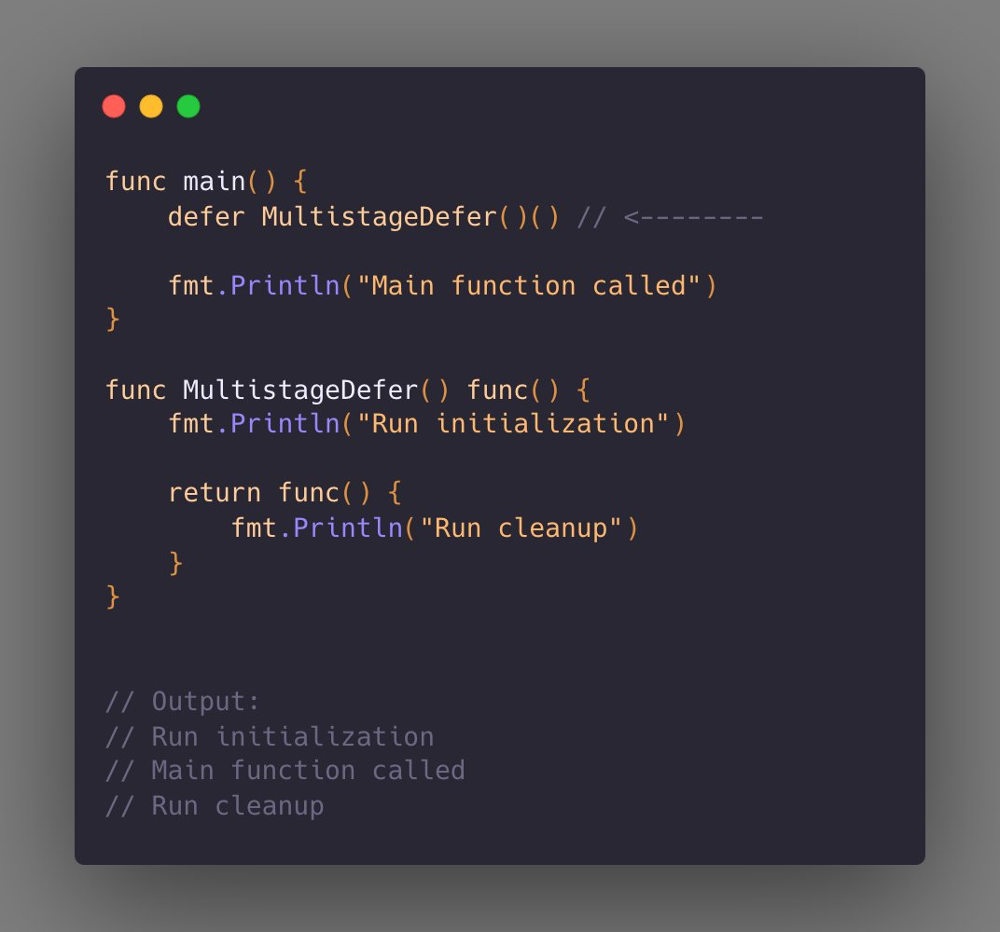

# Tip # Mutistage defer

> 原始链接：[Golang Tips #2: Multistage defer](https://twitter.com/func25/status/1726279577327342009)

With just 'defer', you can execute a function both at the beginning and the end of another function with this trick.

See how in the image below.

