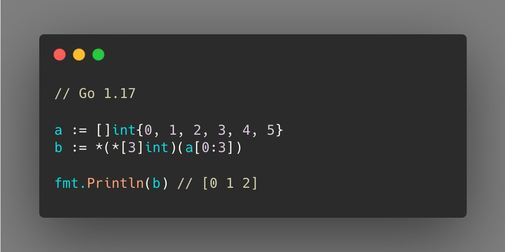

# Tip # Parse an Slice into a Array.

> 原始链接：[Golang Tip #4: Parse an Slice into a Array.](https://twitter.com/func25/status/1727651590667158013)

You might think of using copy(), right?

But this is redundant.

If your project has been updated to Go 1.20, you can parse it more easily, similar to other types of parsing (e.g., int to int32).

But if you're coming from an older version, Go 1.17 still offers a one-liner solution for you.

Personally, I don't use this much, but it's definitely a handy trick to know.
