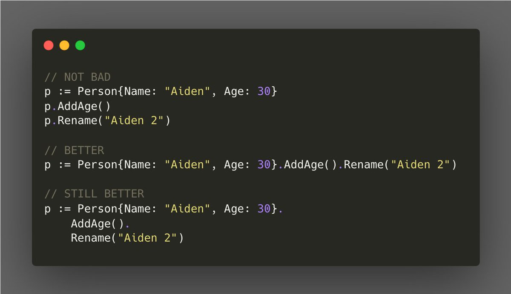

# Tip #Method Chaining

> 原始链接：[Method Chaining](https://twitter.com/func25/status/1728354658673135697)

When defining a receiver function for a type, return the value itself.

This practice allows you to call multiple methods in a single, fluent sequence, known as method chaining, resulting in cleaner and more efficient code.

