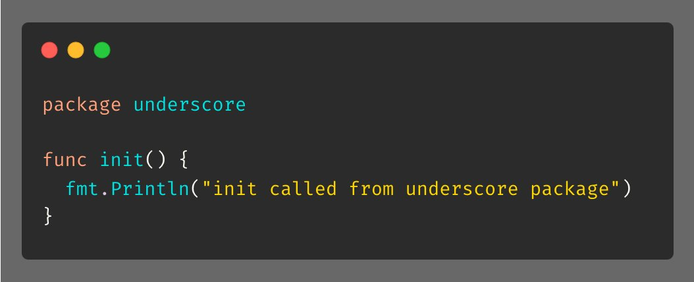

# Tip #Underscore Import

> 原始链接：[Golang Tip #6: Underscore Import](https://twitter.com/func25/status/1729113992902361111)

Sometimes, in many libraries, you may come across import statements combined with an underscore (\_) like this:

What does that do?

This executes the initialization code (init() function) of that package without creating a name reference for it.

For example, in the "underscore" package, I have an init:

And in main(), using underscore import, even if I don't do anything, it still prints:

