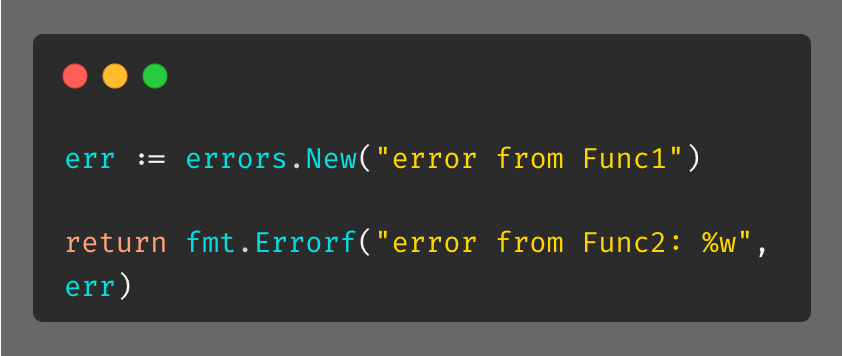
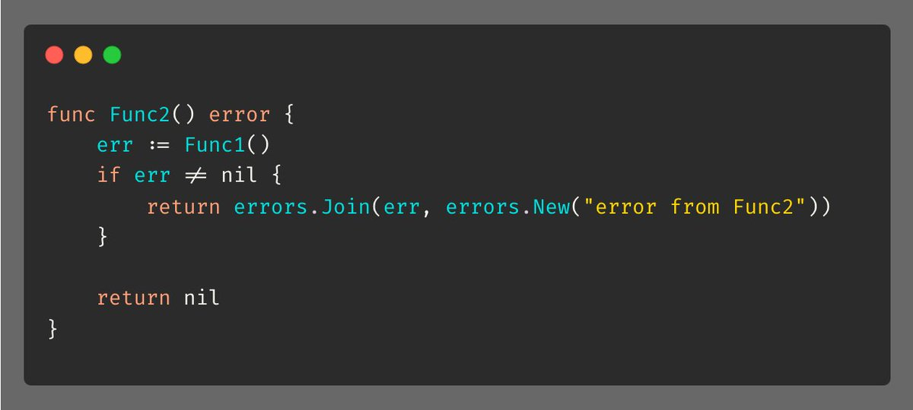

# Tip #Wrapping Errors

> 原始链接：[Golang Tip #8: Wrapping Errors](https://twitter.com/func25/status/1729768084100300945)

Commonly, we used %w with fmt.Errorf to wrap an error in another error, like this:

But with Go 1.20, we have a more straightforward and ergonomic way to wrap errors using errors.Join():

