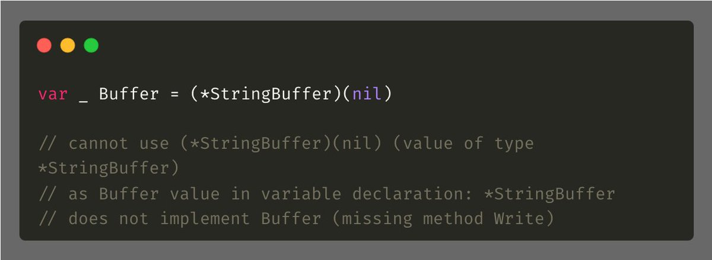

# Tip #Compile-Time Interface Verification

> 原始链接：[Golang Tip #9: Compile-Time Interface Verification](https://twitter.com/func25/status/1729871737343643902)

Imagine a Buffer interface with a Write() function, and a StringBuffer struct implementing it.

If you accidentally make a typo, such as Writeee() like:

The error isn't caught until runtime. By using the trick below, the compiler will alert you with an IDE error message:

