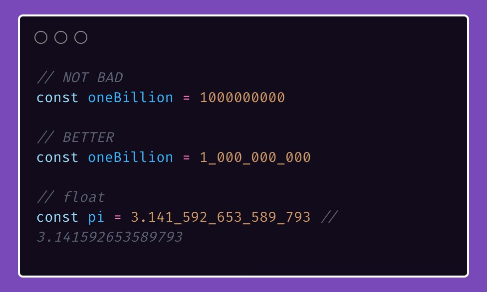

# Tip #Numeric separators

> 原始链接：[Golang Tip #11: Numeric separators.](https://twitter.com/func25/status/1736002190614085979)

This trick shines when dealing with long numbers, keeping your code readable and less error-prone.

Instead of squinting at a long string of digits, break them up for clarity.

