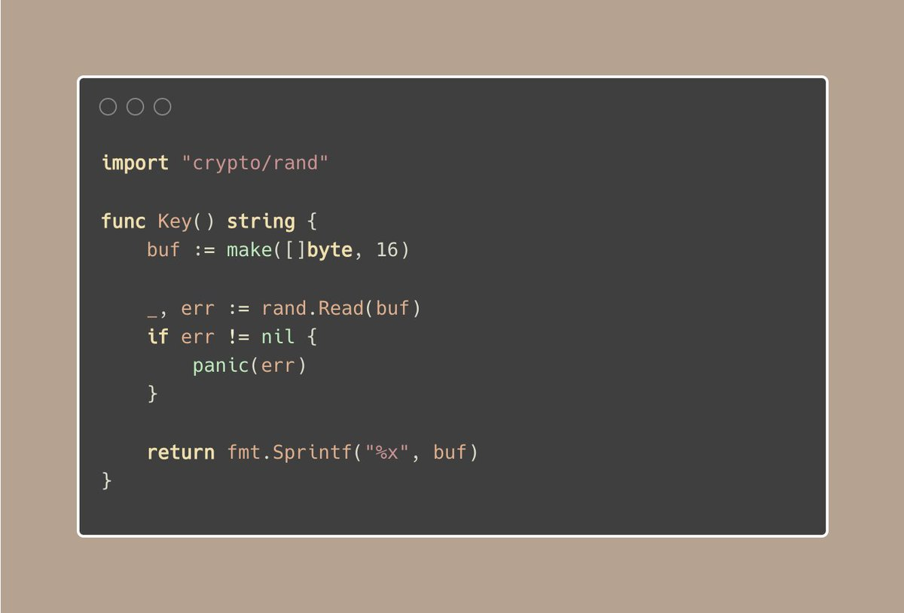

# Tip #Avoid using math/rand, use crypto/rand for keys instead

> 原始链接：[Golang Tip #12: Avoid using math/rand, use crypto/rand for keys instead.](https://twitter.com/func25/status/1754477930531680532)
>
> When you're working on projects that require generating keys, like for encryption or for creating unique identifiers, the quality and security of those keys are really important.

Why not math/rand?

The math/rand package generates pseudo-random numbers.

This means if you know how the numbers are generated (the seed), you can predict the numbers.

Even if you seed it with the current time (like time.Nanoseconds()), the amount of unpredictability (entropy) is low because there's not a lot of variation in the current time from one execution to the next.

Why crypto/rand?

crypto/rand provides a way to generate numbers that are cryptographically secure.

It's designed to be unpredictable, using sources of randomness provided by your OS, which are much harder to predict.

crypto/rand is suitable for encryption, authentication, and other security-sensitive operations.
