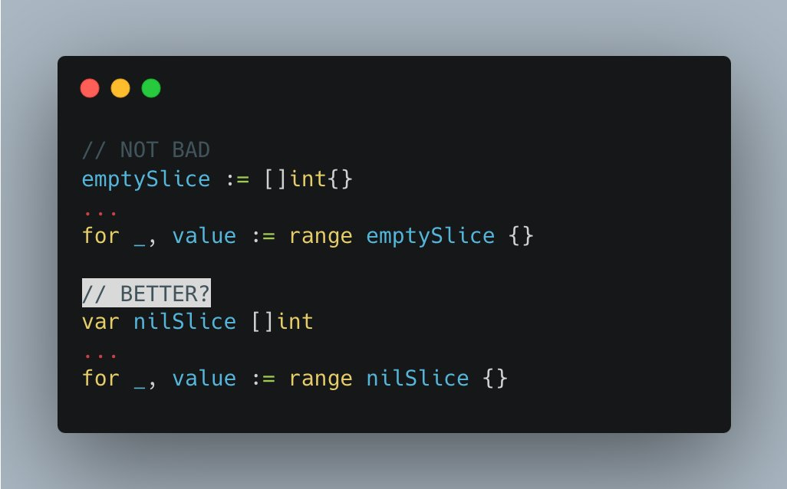

# Tip #Empty slice or, even better, NIL SLICE

> 原始链接：[Golang Tip #13: Empty slice or, even better, NIL SLICE.](https://twitter.com/func25/status/1754852685369524574)

When working with slices in Go, you have two approaches to start with what appears to be an empty slice:

- Using var keyword: `var t []int`

This method declares a slice t of type int without initializing it. The slice is considered nil.

This means it doesn't actually point to any underlying array. Its length (len) and capacity (cap) are both 0.

- Using slice literal: `t := []int{}`

Unlike the var declaration, this slice is not nil. It's a slice that points to an underlying array, but that array has no elements.

So, which one is considered idiomatic?

1. A nil slice doesn't allocate any memory.

It's just a pointer to nowhere, while an empty slice ([]int{}) actually allocates a small amount of memory to point to an existing, but empty, array.

In most cases, this difference is negligible, but for high-performance applications, it could be significant.

2. The Go community prefers the nil slice approach because it's considered more idiomatic to the language's philosophy of simplicity and zero values.

3. Of course, exceptions exist.

For example, when working with JSON, a nil slice and an empty slice behave differently.

A nil slice (var t []int) encodes to JSON as null, whereas an empty slice (t := []int{}) encodes to an empty JSON array ([]).

4. It's also idiomatic to design your code to treat a non-empty slice, an empty slice, and a nil slice similarly.

If you're familiar enough with Go, you may know that for range, len, append,... work without panic with a nil slice.
