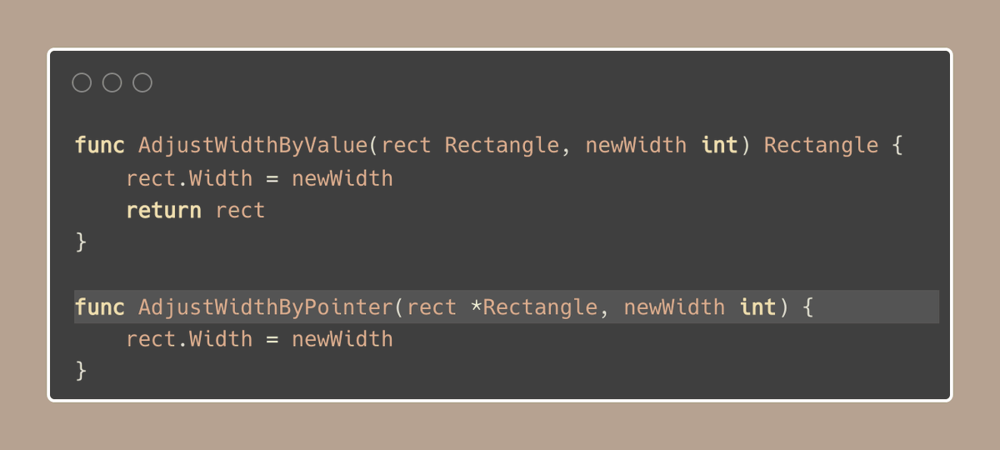

# Tip Pass values, not pointers

> 原始链接：[Golang Tip #20: Pass values, not pointers](https://twitter.com/func25/status/1757387675085279437)

This is a topic that has tripped up many folks (including myself) when we first started with Go.

Often, we're tempted to pass pointers in our functions for a couple of reasons:

- We're looking to avoid the overhead of copying a struct.
- Or maybe, we already have a pointer, and it feels unnecessary to dereference it just to pass the value (\*T).

0. Common thoughts about pointers:

It's pretty common to think of pointers as a clever way to save on memory.

Why copy all that data to pass to a function when you can just send over a tiny address pointing to where the data is stored, right?

But the advice is to prefer passing values directly to functions instead of passing pointers.

Why? Here are 5 key points on when to pass values.

1. Fixed-sized types

We're talking about integers, floats, small structs, and (small) arrays here.

These types have a fixed memory footprint that's often on par with or even less than a pointer's size on many systems.

2. Immutability and clarity.

Passing by value means the function gets its own copy of the data, no strings attached.

This way, you don't have to worry about unintended side effects, so any changes stay local to the function.

Also, passing a pointer means you're signaling to your team: 'I'm not messing with your data, I just need to work with it".

This solution is clear and safe.

Both examples are considered good.

If you want to change the value inside the called function, just do it with a pointer, of course.

3. Small or unlikely to grow types

For data types that are inherently small or unlikely to expand significantly, direct passing avoids the extra step of dereferencing pointers.

4. Passing values is fast and rarely slower than passing pointers.

It might seem counterintuitive because of copying, but the reasons are:

- Copying a small amount of data is very efficient and can often be quicker than the indirection required when using pointers.
- It reduces the workload of the garbage collector, when values are passed directly, the GC has fewer pointer references to track.
- Data that is passed by value tends to be stored closer together in memory, allowing the CPU to access the data more quickly.

Very rarely do you have a struct LARGE enough that benefits from passing by pointer

5. Make passing values your default.

Only consider pointers if you've got benchmarks showing a clear advantage.

A tiny bit of performance gain often isn't worth sacrificing clarity.

Sure, pointers can speed things up for large or growing (unbounded) structs, but you've got to prove it's worth it.
