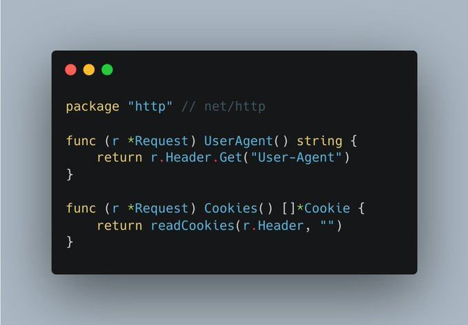

# Tip #23 省略 getter 方法的'Get'前缀

> 原始链接：[Golang Tip #23: Skip the 'Get' prefix for getters](https://twitter.com/func25/status/1758798018227441764)

When we're coding, to name a function we start with a verb, right? get, set, fetch, update, calculate,...

But getters are one of the exceptions in Go

> "Why I even need getters and setters?"

In Go, encapsulation is applied through method visibility and naming conventions, subtly supporting encapsulation without strictly enforcing getter/setter methods.

Yet, if additional logic is needed or if we want to access a computed field, there's nothing wrong with manually defining getters and setters

> "What is the idiomatic way to define a getter name?"

The idiomatic way is to simply use the field name with the first letter capitalized for getters (to export it):

Another illustrative example involves methods that provide computed properties or configurations that aren't directly stored as fields within a struct.

