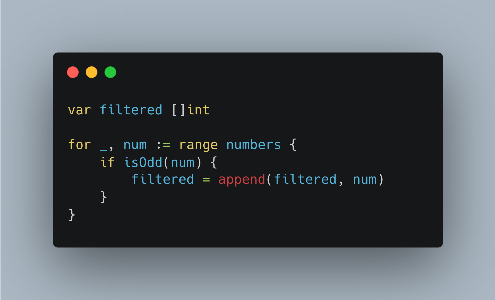

# Tip #Filter without any allocation

> 原始链接：[Golang Tip #27: Filter without any allocation.](https://twitter.com/func25/status/1760288508600590594)

When we filter slices in Go, the typical solution is to generate a new slice for the filtered elements.

This method, however, leads to additional memory allocation:

A smarter way to tackle this is by filtering the slice "in place," making use of the original slice's underlying array.

Here’s how it works:

- 'filtered := numbers[:0]' creates a new slice 'filtered' that shares the underlying array with 'numbers', but starts with zero length while retaining numbers's capacity.
- As we append 'num' to 'filtered', we avoid extra memory allocations because we're effectively modifying 'numbers' (or underlying array of 'numbers').

So we're not allocating new memory, we're populating the existing array:

Keep in mind, this technique is best used when:

- We no longer need 'numbers' after filtering.
- And performance is critical, especially with large datasets.
