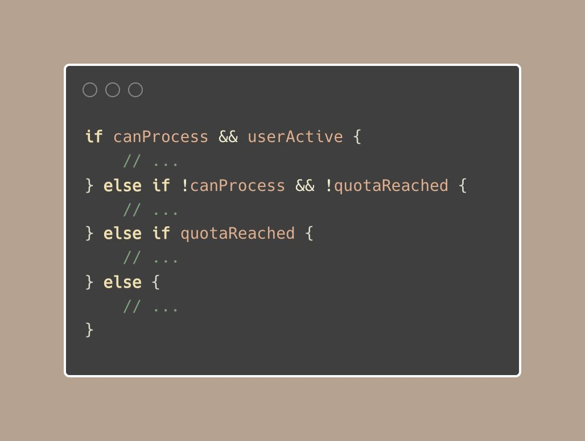
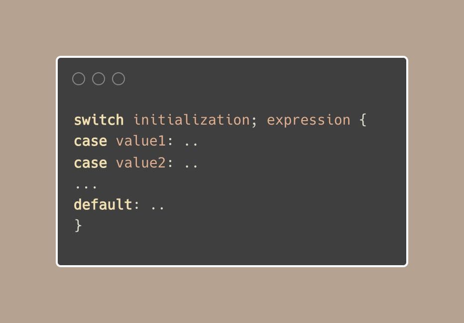

# Tip #Converting multiple if-else statements into switch cases

> 原始链接：[Golang Tip #28: Converting multiple if-else statements into switch cases.](https://twitter.com/func25/status/1760648317942600114)

It's common to encounter complex conditional logic handled through multiple if-else statements:

This approach isn't wrong.

But there's a cleaner, more readable alternative: collapsing if-else chains into switch statements

Now, first, we should understand how the switch-case structure works:

We can ignore 'initialization', and also 'expression'. When we do this, we are essentially writing: switch true {}, but the true is implicit.

Now, back to our example, let's enhance it with what we just discussed:

This tip is actually part of what I tweeted before but haven't provided a use case yet:[twitter.com/func25/status/…](https://x.com/func25/status/1745774945920245800?s=46)
