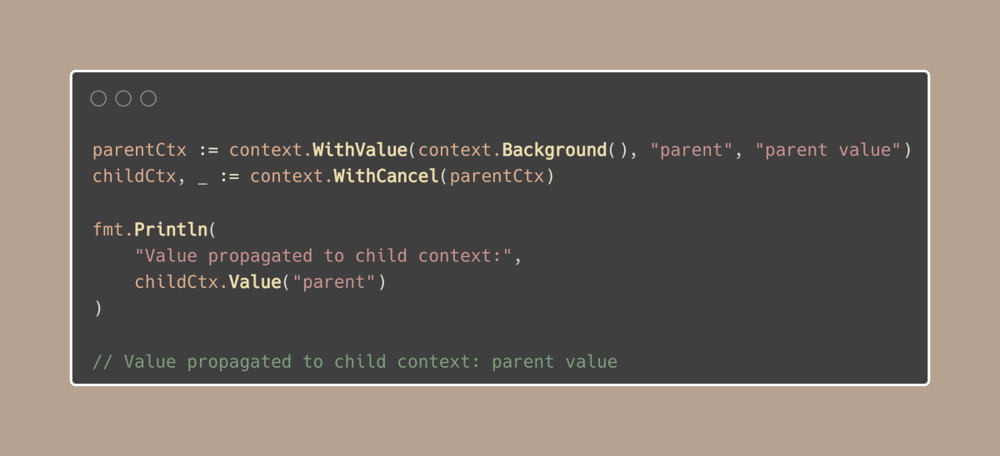

# Tip #30 使用 context.WithoutCancel()继续上下文操作

> 原始链接：[Golang Tip #30: Keep contexts going with context.WithoutCancel()](https://twitter.com/func25/status/1761388781201174853)

When we filter slices in Go, the typical solution is to generate a new slice for the filtered elements.

This method, however, leads to additional memory allocation:

But sometimes, that's not what we want.

There are scenarios where we need certain operations to proceed without being interrupted by the cancellation of their parent context.

Imagine you're handling an HTTP request where, upon cancellation (client timeout, disconnection, etc), you still want to log the request details and collect metrics.

> "Hah, I'll just need to create a new context for those operations"

That's a solution, but the new context lacks the values from the original event's context, which are important for tasks such as logging, collecting metrics.

Only a child context can be propagated with these values:

Now, back to our HTTP example, here is the solution:

WithoutCancel ensures that these operations can complete without being halted by the request's cancellation.

By the way, this function was added in Go 1.21.
