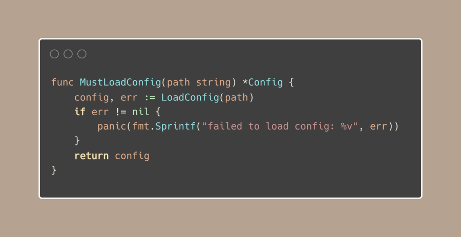
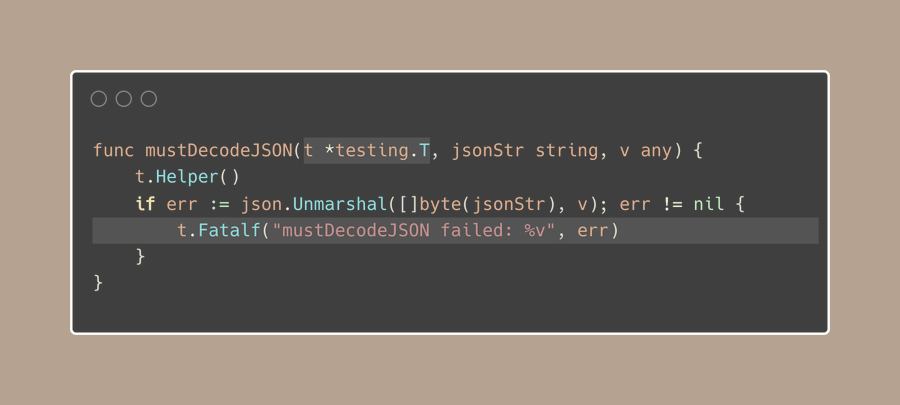

# Tip #Intentionally Stop with Must Functions

> 原始链接：[Intentionally Stop with Must Functions](https://twitter.com/func25/status/1766442686624784496)
> Here's a tip that might initially seem counterintuitive, using 'Must functions' to intentionally allow your program to stop.

Typically, we avoid situations where our program could panic, but there are exceptions where this solution actually cuts down on verbosity:

If you've worked with Go, it's likely you've seen these functions in the standard library.

These functions have a particular naming pattern, they start with 'Must' (or 'must'). This is a heads up that they can cause a panic if things don't go as expected.

Must functions are primarily used for:

- Initialization tasks that should not fail under normal situations, like setting up package-level variables at the start of an application, setting up regex, connecting to databases, etc.

- They're also quite useful in testing scenarios, allowing immediate test failure with t.Fatal:

Must functions are tools for initialization and testing, where failure is really unexpected.

They simplify error handling in specific contexts but should be used judiciously to avoid panicking.

(Talking about a tip that encourages our application to stop might feel a bit odd 😬)
