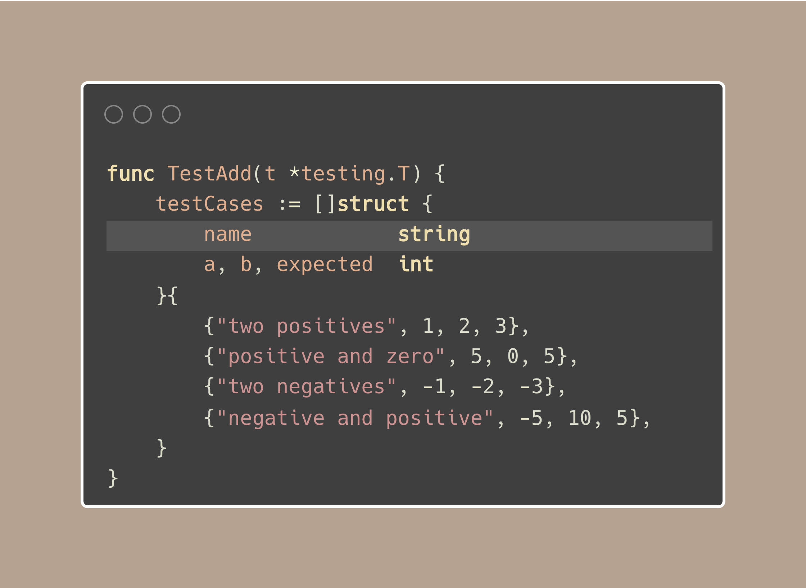

# Tip #47 Table-driven tests, subtests, and parallel tests.

> 原始链接：[Golang Tip #47: Table-driven tests, subtests, and parallel tests.](https://twitter.com/func25/status/1767541900960276913)

It would be a big oversight if our tip series skipped the testing section, which makes us sleep in peace after deploying.

1. Table-driven Tests

Table-driven testing is a method where you outline tests in a table, detailing inputs and the expected results.

Let's look at a simple example: we have an add() function that sums two operands.

Here are our test cases:

After setting these up, we run all the test cases with just one Test function:

And that's it. We can add as many test cases as we want and if any fail, they'll print out neatly on your console (or any output).

For example, here are some failed tests after mistakenly using a\*b in add():

--- FAIL: TestAdd (0.00s)
add(1, 2) = 2; want 3
add(5, 0) = 0; want 5
add(-1, -2) = 2; want -3
add(-5, 10) = -50; want 5

> "But I don't want to run the rest after 1 test failed because it's slow."

Instead of t.Errorf, we could use t.Fatalf, which combines t.Logf + t.FailNow.

Now, we're missing one thing: the name of the test case.

Naming becomes super important when a test fails. It helps us quickly know which test didn't pass without needing to look closely at the inputs and expected result.

2. Subtests & Parallel

Subtests let you organize tests logically and run them as part of a larger test function.

First, let's give each test case a name:

Then, we slightly change our test to add a subtest and parallel execution, notice these two updates:

Post
See new posts
Conversation
Phuong Le
@func25
💡Golang Tip #47: Table-driven tests, subtests, and parallel tests.

It would be a big oversight if our tip series skipped the testing section, which makes us sleep in peace after deploying.

1. Table-driven Tests

Table-driven testing is a method where you outline tests in a table, detailing inputs and the expected results.

Let's look at a simple example: we have an add() function that sums two operands.

Here are our test cases:

After setting these up, we run all the test cases with just one Test function:

And that's it. We can add as many test cases as we want and if any fail, they'll print out neatly on your console (or any output).

For example, here are some failed tests after mistakenly using a\*b in add():

--- FAIL: TestAdd (0.00s)
add(1, 2) = 2; want 3
add(5, 0) = 0; want 5
add(-1, -2) = 2; want -3
add(-5, 10) = -50; want 5

> "But I don't want to run the rest after 1 test failed because it's slow."

Instead of t.Errorf, we could use t.Fatalf, which combines t.Logf + t.FailNow.

Now, we're missing one thing: the name of the test case.

Naming becomes super important when a test fails. It helps us quickly know which test didn't pass without needing to look closely at the inputs and expected result.

2. Subtests & Parallel

Subtests let you organize tests logically and run them as part of a larger test function.

First, let's give each test case a name:

Then, we slightly change our test to add a subtest and parallel execution, notice these two updates:

I couldn't add more than four images on X, but the results printed on the console are now really structured.

They show you which test and which subtest failed in a hierarchy:

--- FAIL: TestAdd (0.00s)
--- FAIL: TestAdd/two_positives (0.00s)
add(1, 2) = 2; want 3

This setup makes your testing output clear and easy to follow, helping you identify and fix issues faster.
