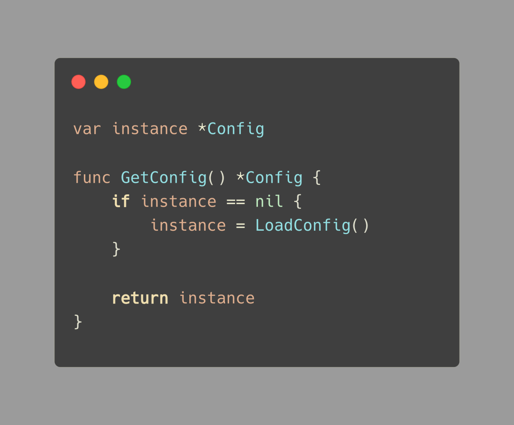

# Tip #sync.Once is the best way to do things once

> 原始链接：[Golang Tip #60: sync.Once is the best way to do things once](https://twitter.com/func25/status/1772587758114255322)

This solution is common when we're dealing with singletons. Sometimes singletons can be a problem, but in some cases, they're okay.

We're going to talk about:

- The problem
- How to fix it
- A misunderstanding
- The way sync.Once actually works

Let's say we've got a config object that needs to be set up only once when it's first called for, and then it's shared after that.

Here's a simple way to do it:

There is a problem with it when lots of things are happening at the same time.

If many goroutines try to get the config at the same time when it's not set up yet, we might end up LoadConfig() more than once.

That's not what we want.

Now, let's look at how sync.Once can help out:

We make a function that sets up the config and gives it to once. Do(f)

Even if a lot of goroutines call GetConfig() at the same time, sync.Once makes sure the setup function we gave to .Do(..) only runs a single time.

sync.Once can't be used more than once.

Here's the thing, if we try to use sync.Once again, with another function, it won't work.

Like this:

o .Do(f1)
o .Do(f2)

The second function, f2, is just going to be ignored, even though it's not the same as f1.

How does it work?

A sync.Once keeps track of two things:

- An atomic counter (or flag) with 2 values: 0 and 1.
- A mutex to protect the slow path.

We'll talk about what's called the fast path and slow path in a bit, but let's look at how sync.Once is put together:

The fast path
When once. Do(f) is called, it first looks at the atomic counter. If the counter is at 0, it means the function hasn't been run yet.

This fast path is there for when the function has already been done, so any other calls can skip the line and don't have to wait around.

The slow path

The slow path is what kicks in if the counter isn't 0. sync.Once will then go into slow mode with doSlow(f):

- o.m.Lock(): It locks things down with the mutex to make sure only one goroutine can go through these next steps at a time.

- o.done.Load() == 0: After it's got the lock, it checks the counter again to make sure no one else got there first.

- o.done. Store(1): And to make sure we know the function is all done, it updates the counter after the function is finished.

> "Why slow path and fast path?"

We use the fast path and the slow path because we want to be quick when possible, but also safe when necessary.

The slow path is just for the initial setup, which is a short moment. Once that's done, every call to .Do is quick, which is better for the long run.
