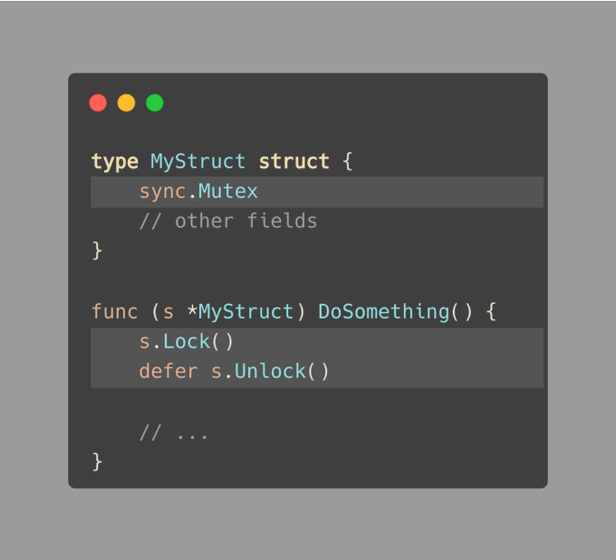

# Tip #Making a Type with Built-In Locking (sync.Mutex embedding)

> 原始链接：[ Golang Tip #61: Making a Type with Built-In Locking (sync.Mutex embedding)](https://twitter.com/func25/status/1772934326189240607)

When writing code that multiple parts of our program can access at the same time, we often use a sync.Mutex to keep things safe.

Here's a common way to do it:

This solution can make our code cluttered with .mu.Lock() and .mu.Unlock() calls.

To clean it up, we can embed sync.Mutex right inside the struct. Now we can just call Lock and Unlock on the struct itself:

But keep this in mind: if MyStruct is public (starts with an uppercase letter), adding sync.Mutex directly makes its Lock and Unlock methods public too.

So, it might be a better idea for types that are not meant to be shared outside the package.

The Generic Trick

While checking out some ideas and online stuff, I've seen this neat method.

To make a type that's ready for locking, you can use a generic type:
(Turns out we can't embed T in Lockable.)

This way, we can protect any type from being used in too many places at once. Either use it as is, or make a new type:

