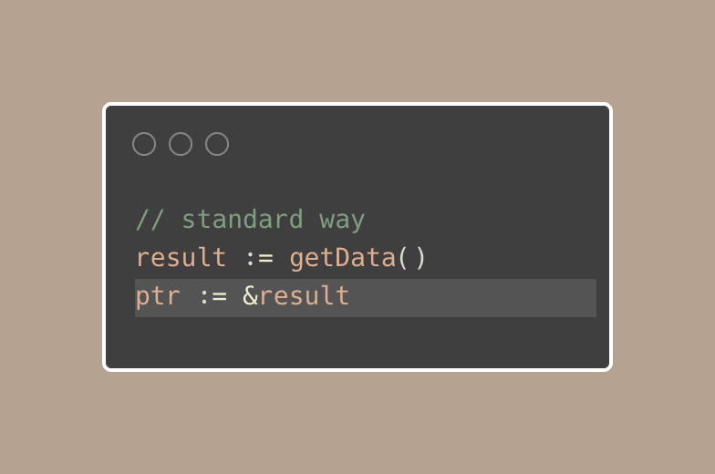

# Tip #Returning Pointers Made Easy with Generics

> 原始链接：[Golang Tip #65: Returning Pointers Made Easy with Generics.](https://twitter.com/func25/status/1775141980835827875)
> Here's a quick tip for those of you coding in Go who often need a pointer to a certain value.

Before, you might have done something like this:

Or maybe you've tried to do it all in one line using a little trick:

This way works fine, but it's a bit long, especially if you have to do it a lot with different kinds of data.

Now, let's look at a newer, easier method with generics:

This little function lets you make a pointer for any type of value without having to write the same kind of code over and over.

Just give your value to Ptr, and you'll get the pointer you need:

It makes your code much cleaner and stops you from writing the same thing over and over.

You don't need separate functions or to handle pointers manually for each type. Keep your code simple and focused on what matters.
