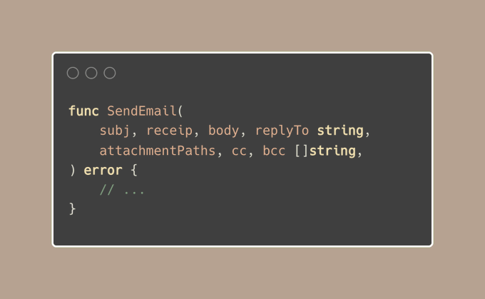

# Tip #How to deal with long function signatures

> 原始链接：[ Golang Tip #67: How to deal with long function signatures](https://twitter.com/func25/status/1775910818116411508)

When you're working with function signatures in Go that have many arguments, long names, a receiver, multiple return results, something like this:

func SendEmail(subj string, receip string, body string, attachmentPaths []string, cc []string, bcc []string, replyTo string) error

There are several ways to solve this without disrupting the flow of your code (from top to bottom):

1. Long arguments may indicate the function is doing more than it should, consider splitting it into smaller functions.
2. If any argument is optional, consider using the optional struct or variadic functions. This technique was introduced in a tip I shared earlier (https://twitter.com/func25/status/1758435261183353308).
3. If arguments are required, you can still group them into a struct and validate them, throwing an error if necessary.
4. Use shorter names that are still clear and descriptive.
5. Arguments with the same types can have the type stated once.

> "But I still want to keep 4 or 5 arguments; I don't want to create a new struct every time."

Semantic Line Breaks

A cleaner solution is to place a group of parameters on its own line based on their semantic relationship:

Even though it's a bit more verbose because of the multiline, it keeps everything we need to read within sight.
