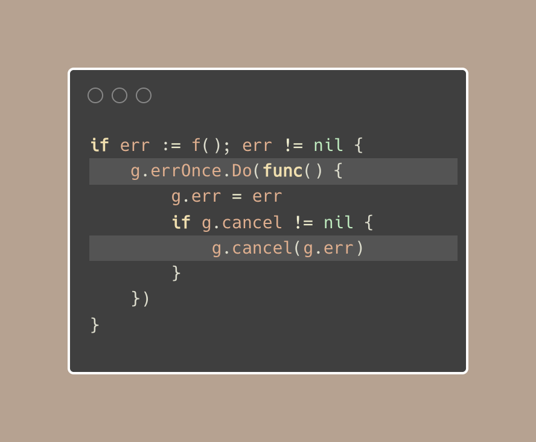

# Tip #Manage multiple goroutines with errgroup

> 原始链接：[ Golang Tip #69: Manage multiple goroutines with errgroup](https://twitter.com/func25/status/1776555387254358509)

When we're dealing with a bunch of goroutines, it can be a bit hard to handle errors and make sure they all work together well.

You might know sync.WaitGroup, right? But there's a package called errgroup that makes this easier:

In the example we're discussing, we fetch 2 pages and wait for them with g.Wait().

Errgroup is a tool designed to help us manage multiple goroutines and handle any errors they throw during their execution.

There are 3 concepts to keep in mind:

- To run tasks concurrently, start a goroutine with g.Go() and pass it a function.
- Use g.Wait() to wait until all goroutines are done, it gives you the first error that happened, not all of them.
- Errgroup works well with context.

By using errgroup.WithContext(), if an error happens, the context is canceled.

What's going on inside

1. The Group struct uses a mix of:

- sync.WaitGroup for waiting on all goroutines to finish
- sync.Once to make sure that the first error is captured in a thread-safe way
- A semaphore chan to control how many goroutines can run simultaneously (We can even set a limit with errg.SetLimit())

2. The errg.done() is a helper that marks a goroutine as completed.

It decrements the active goroutine count (if a limit is set) and lets the WaitGroup know that the goroutine has completed:

3. It keeps error handling in one place.

With errOnce, only the first error is recorded, which then triggers a stop and is returned by Wait.

Post
See new posts
Conversation
Phuong Le
@func25
💡Golang Tip #69: Manage multiple goroutines with errgroup

When we're dealing with a bunch of goroutines, it can be a bit hard to handle errors and make sure they all work together well.

You might know sync.WaitGroup, right? But there's a package called errgroup that makes this easier:

In the example we're discussing, we fetch 2 pages and wait for them with g.Wait().

Errgroup is a tool designed to help us manage multiple goroutines and handle any errors they throw during their execution.

There are 3 concepts to keep in mind:

- To run tasks concurrently, start a goroutine with g.Go() and pass it a function.
- Use g.Wait() to wait until all goroutines are done, it gives you the first error that happened, not all of them.
- Errgroup works well with context.

By using errgroup.WithContext(), if an error happens, the context is canceled.

What's going on inside

1. The Group struct uses a mix of:

- sync.WaitGroup for waiting on all goroutines to finish
- sync.Once to make sure that the first error is captured in a thread-safe way
- A semaphore chan to control how many goroutines can run simultaneously (We can even set a limit with errg.SetLimit())

2. The errg.done() is a helper that marks a goroutine as completed.

It decrements the active goroutine count (if a limit is set) and lets the WaitGroup know that the goroutine has completed:

3. It keeps error handling in one place.

With errOnce, only the first error is recorded, which then triggers a stop and is returned by Wait.

Also, using goroutines might not always be the best choice, especially if the tasks are quick. Sometimes, doing them one after another could be better.
