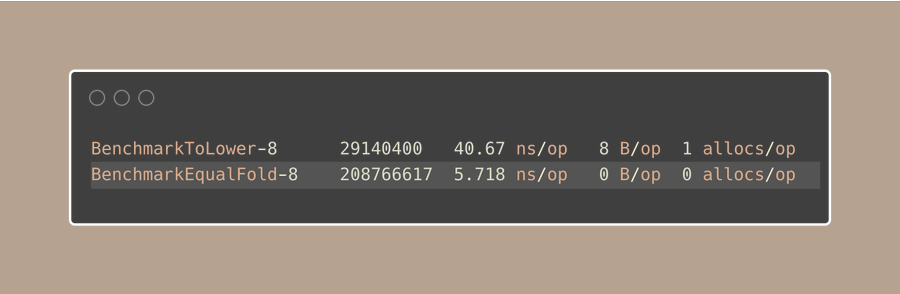

# Tip #Case-Insensitive string comparison with strings.EqualFold.

> 原始链接：[Case-Insensitive string comparison with strings.EqualFold](https://twitter.com/func25/status/1777673942079283694)

When you need to compare strings without caring about whether the letters are upper or lower case, you might think to:

- Make both strings lower case using strings.ToLower()
- Or make them both upper case using strings.ToUpper()

And then check if they are the same:


But, there's a better way to compare strings without worrying about case in Go.

Use strings.EqualFold:


We pick strings.EqualFold not just because it's shorter, but because it's made for case-insensitive comparisons, so it does the job well.

> "Is strings.EqualFold faster than using ToLower and then comparing?"

Yes, it's the usual method in Go for comparing strings without case sensitivity:



Case folding isn't just about changing letters to uppercase or lowercase.

It's careful to handle the details of Unicode, making sure it works right for all languages, not just the simple English (or ASCII?) characters:


In short, it starts by:

- Fast path: quickly checking ASCII characters, looking at each character one by one.
- Slow path: If it finds a Unicode character in any of the strings, it switches to a detailed Unicode comparison.

Notice that, you can still use strings.ToLower or strings.ToUpper for example above, but it's about speed and making your code easy to read.

There are times when even strings.EqualFold isn't enough, for example:

```go
s1 := "Resumé" // Normal 'é'
s2 := "resume\u0301" // 'e' followed by a combining acute accent
```

In this case, strings.EqualFold will not be enough on its own because the characters look the same but are encoded differently.

To properly compare these strings, you'll need other ways to handle strings with "http://golang.org/x/text/unicode/norm"
