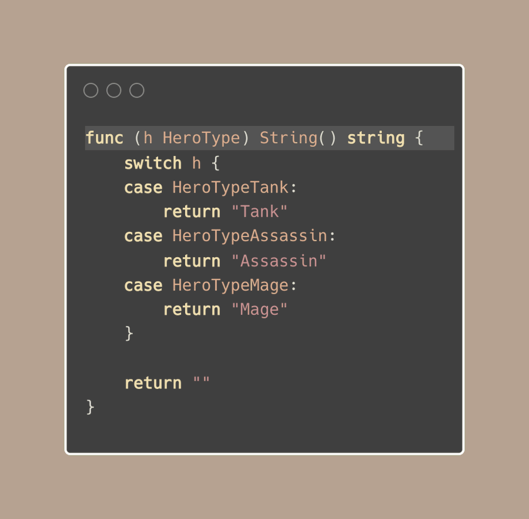

# Tip #Implement String() for enum with the stringer tool.

> 原始链接：[ Implement String() for enum with the stringer tool](https://twitter.com/func25/status/1778027410929410111)
>
> Have you noticed when you print a duration in Go, like fmt.Println(time.Second), it shows up as "1s" instead of "1000000000" while time.Duration is int64.

This is because the time.Duration type has a String() method that makes it print out in a way that's easy to understand.

This method is part of the fmt.Stringer interface:


For our own custom types to be just as clear, we can add a String() method too.

Now, for enums, we often use numbers, but we also want to print out something that's easy to read.

We might write a function with a switch statement to do this:



However, this can be extra work.

If we change the enum and forget to update this function, it can lead to problems.

Luckily, Go has the Stringer tool, a command-line tool that can automatically create a String() method for us:


> "Do we need to run it for every single type in different packages?"

That's where "go generate" comes in.

We just add a special comment in our code, and "go generate" will invoke the stringer and create the String() method for us:


We can place the comment anywhere in the same package, but I prefer putting it right above of enum type.

There are options to change how String() works:

**-trimprefix**: to remove part of the name.

If we have HeroTypeTank, it will normally show as "HeroTypeTank". With -trimprefix set to "HeroType", it will just show as "Tank".

```go
//go:generate stringer -type=HeroType -trimprefix=HeroType
```

**-linecomment**: pick a completely different name. Just put the comment right after the enum value.

```go
HeroTypeAssassin // Something

//go:generate stringer -type=HeroType -linecomment
```
