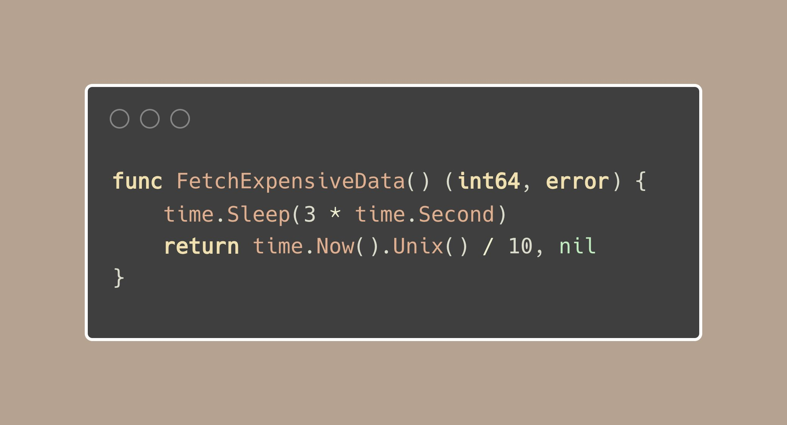
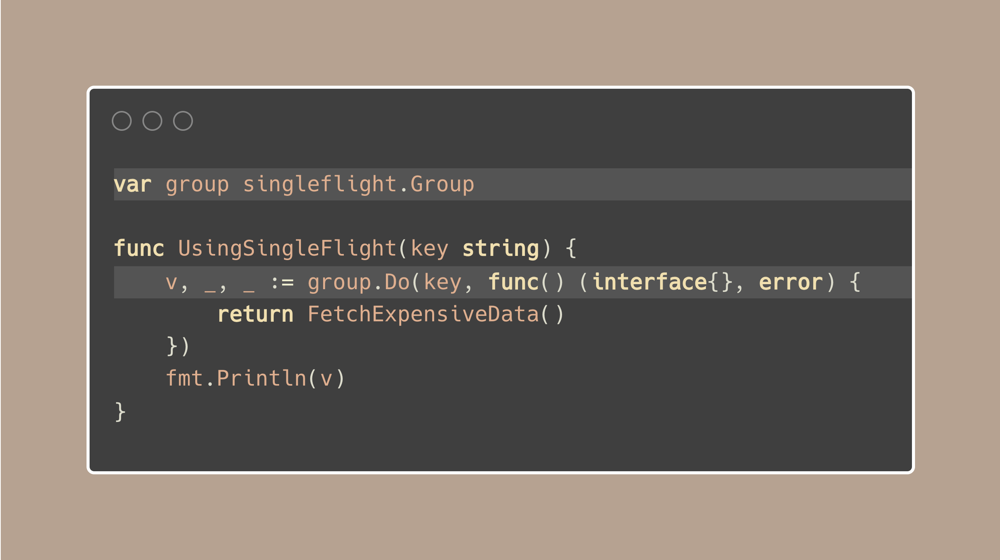

# Tip #Optimize multiple calls with singleflight.

> 原始链接: [Golang Tip #75: Optimize multiple calls with singleflight.](https://twitter.com/func25/status/1778770235316916427)

Let's consider you've got a function that fetches data from the network or performs some I/O and it takes around 3 seconds:

The above function emits a different number after 10 seconds.

- Now, if you call this function 3 times in a row, you end up waiting for about 9 seconds in total.
- If you decide to use 3 goroutines, the total wait time might drop to around 3 seconds, but you're still running that function 3 times just to receive the same result. (~99%)

Here's where the singleflight package comes into play and it's pretty useful. You can find it at http://golang.org/x/sync/singleflight.

This package can help us run that function just once, no matter how many times it's called in that 3 seconds, and it gives back one reliable result.

This is excellent for optimizing functions that take a long time or use a lot of resources. Here’s how it works:
We start by creating a singleflight∙Group object. Then, we pass our function that fetches expensive data into the group∙Do() method of this object.

The group∙Do returns: (result any, err error, shared bool), the 'shared' part is straightforward, it simply indicates if the result was shared across multiple calls.

And that's basically it.

> "What's the purpose of the 'key' argument"

The key is essentially an identifier for the request.

When multiple requests with the same key come in, singleflight realizes they're asking for the same thing.

If you want to see it in action: https://go.dev/play/p/dxQQrznx7m4

Using this, if the same function is called multiple times at once, only one actual call to the function is made. The result from this single call is then shared among all the callers.
