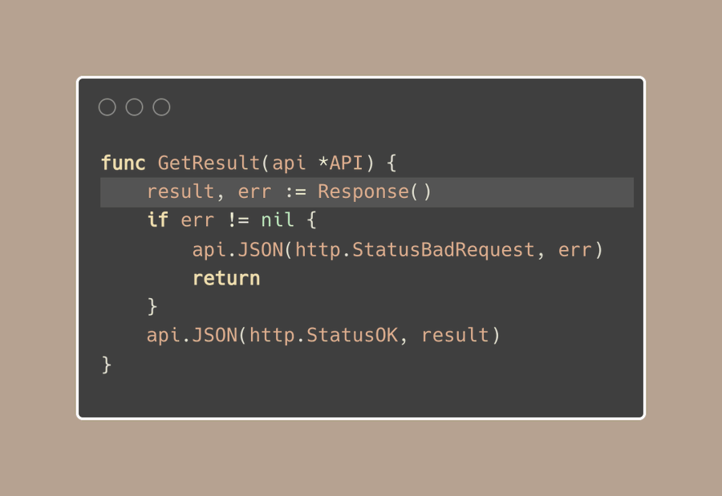

# Tip #Result forwarding in function call

> 原始链接：[Golang Tip #76: Result forwarding in function call](https://twitter.com/func25/status/1779128931586850890)

When I first started using Go, I found one concept a bit tricky: result forwarding in function calls.

It's common to get multiple values back from a function, usually a result along with an error, look at how we handle the processResult(result) at the end:


What's neat is that we can pass the result directly to processResult function if it fits the expected type:


Now, here’s an example: we get a result and an error, and we need to respond to the client with status code based on that.

Typically, you might see many controllers or functions in the API layer doing the same thing.

They take the (result, error) and send back a 400 status code if there's an error, or a 200 OK if everything is fine:



Instead of repeating this pattern across multiple functions, we could simplify our code by creating a standard way to handle these responses based on the function calls:


This tip works really well when combined with a 'must' function, which I talked about here: https://twitter.com/func25/status/1766442686624784496.

I also have a little helper (generic) function, it returns the result if there’s no error, otherwise it stops the process:

```go
func Must[T any](result T, err error) T { ... }
```
