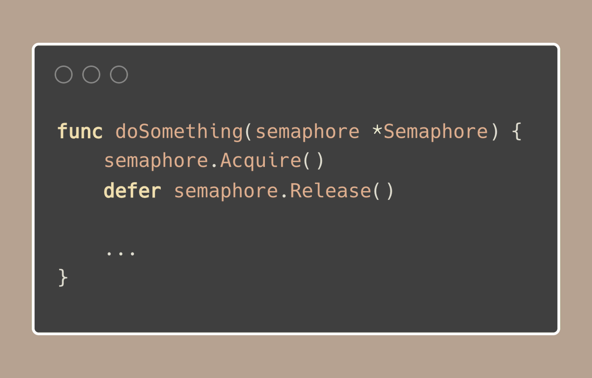

# Tip #Buffered channels as semaphores to limit goroutine execution

> 原始链接：[Golang Tip #77: Buffered channels as semaphores to limit goroutine execution](https://twitter.com/func25/status/1779871103344873757)

When we need to manage 'how many goroutines can access a resource simultaneously', using a semaphore is a reliable approach.

We can create a semaphore using a buffered channel, where the channel's size determines how many goroutines can run at the same time:

Here's what happens:

- A goroutine sends a value into the channel, occupying one slot.
- After completing its task, it removes the value, thereby freeing that slot for another goroutine.

In this example:

- wg.Add(10): We are preparing for 10 goroutines to complete their tasks.
- make(chan struct{}, 3): This sets up a semaphore that allows only 3 goroutines to operate at the same time.

If you want a cleaner way to manage this, we might think about creating a Semaphore type that handles all semaphore-related actions:

Using this custom Semaphore type simplifies how we manage access to resources in our functions:

Also, there’s a semaphore implementation in the http://golang.org/x/sync/semaphore package, which is a weighted semaphore.

A weighted semaphore allows a goroutine to eat more than one slot, useful in scenarios where tasks vary in resource consumption.

For example, managing a pool of database connections where some operations might require multiple connections at once.
