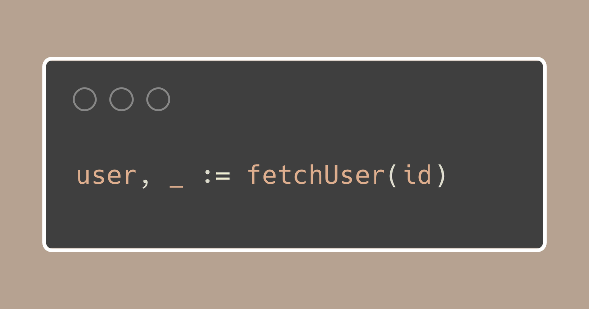

# Tip #If doing something unusual, comment why

> 原始链接：[Golang Tip #79: If doing something unusual, comment why](https://twitter.com/func25/status/1784197311926808655)

I've been reviewing code for a while, and realized that one of the most common and frustrating issues is the lack of comments explaining unusual code choices.

When we've worked with Go long enough, we understand that most of the code should follow to commonly used idiomatic patterns and community practices.

But occasionally, we need to break away from these norms, for instance:

Ignoring errors or returned results, this line might confuse or surprise the reviewer or other team members.

It's not immediately clear why the error is being ignored. Perhaps the error isn't critical, and the functionality can proceed without a valid user, but why is that the case?

Here’s how we could clarify:

This comment quickly tells the reader that ignoring the error is a deliberate decision because the subsequent code can handle a nil user appropriately.

Again, the error shouldn't be ignored; it's just an example. At least, log it.

There is another one:

If we don't highlight the unusual line, it's hard to see what's surprising.

So, the comment is not only about why we choose to use 'err == nil' but also to notify the teammate, "Hey, this is unusual code, look at it."

This is unusual, and it's easily overlooked, the unusual detail is too minor to see.

So, always comment when you do things differently.
