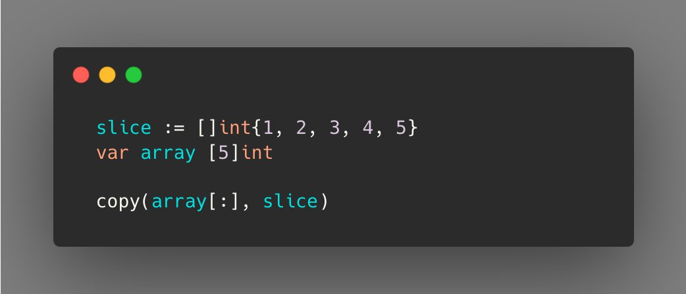
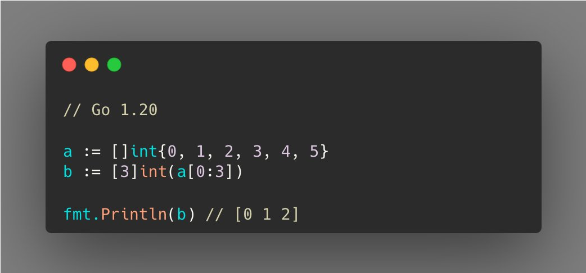

# Tip #3 将数组解析为切片

>  原始链接：[Golang Tip #4: Parse an Array into a Slice.](https://twitter.com/func25/status/1727651590667158013)
>

> 译者注: 标题其实写反了，应该是 “把切片转换成数组”

你可能想到使用copy()方法，对吧？

但是这是多余的。

如果你的项目已经更新到Go 1.20版本，你可以更轻松地解析它，类似于处理其他类型的解析（例如int转int32）。

但是，如果你还在使用旧版本，Go 1.17仍然为你提供了一行代码解决方案。

个人而言，我不常用这个方法，但它确实是一个值得了解的实用技巧。