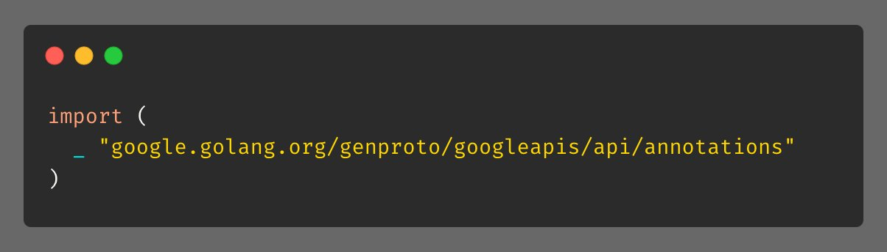
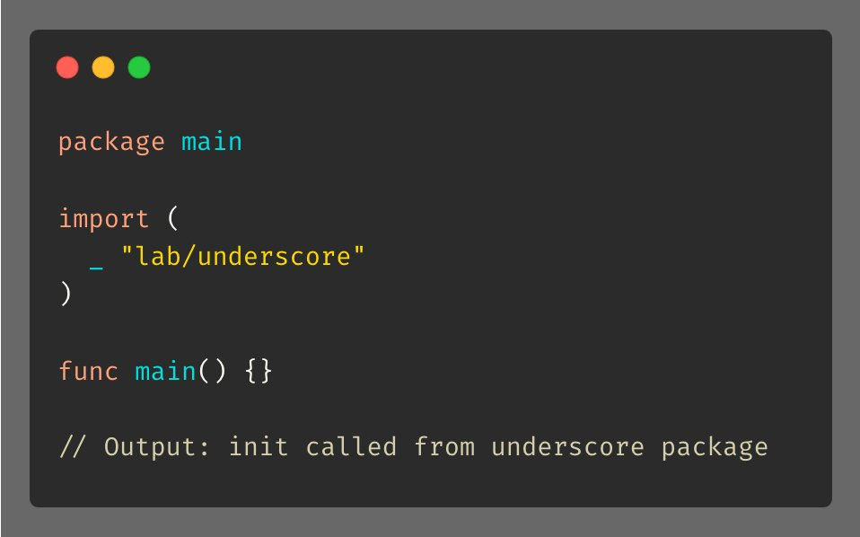

# Tip #6 下划线导入

> 原始链接：[Golang Tip #6: Underscore Import](https://twitter.com/func25/status/1729113992902361111)

有时候，你会在很多库里看到 `import` 和下划线（ `_` ）一起使用的情况，类似这样：

这样的作用是什么呢？

它会在不创建那个包的引用的情况下，执行那个包里的初始化代码（ `init()` 函数）。

例如，在 `underscore` 包里，我写了个 `init` 函数：

然后在 `main()` 里，使用下划线导入，我甚至什么都没做，它依然会打印出来：

