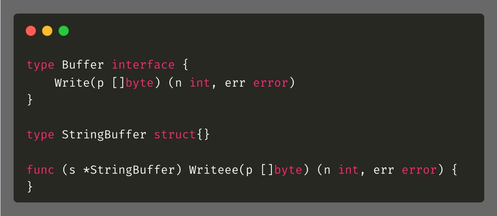

# Tip #9: 编译时接口检查

>  原始链接：[Golang Tip #9: Compile-Time Interface Verification](https://twitter.com/func25/status/1729871737343643902)
>

假设有一个`Buffer`接口，它具有一个`Write()`方法，然后`StringBuffer`这个结构体实现了这个接口。

如果你不小心打错字，例如把`Write()`写成了`Writeee()`：

那么直到运行时才会抛出错误。使用了下面这个技巧后，编译时就会报错：

