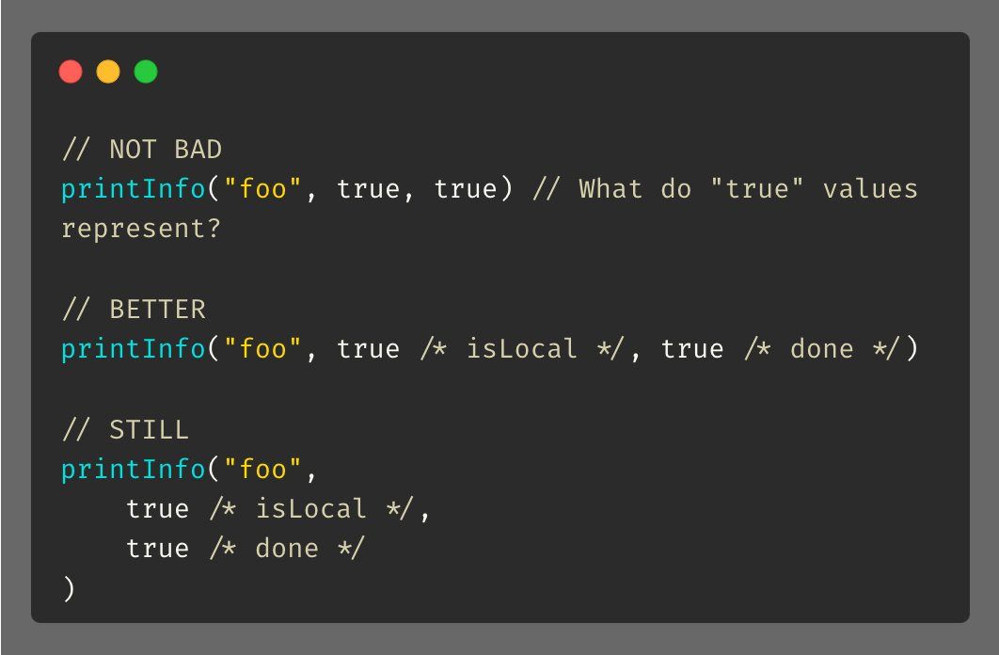

# Tip #10 避免裸露参数

> 原始链接：[Golang #1: Measure the execution time of a function in just one line of code.](https://twitter.com/func25/status/1725431804667244715)

这是一个简单易行的技巧，可以提高函数的可读性，特别是在你的集成开发环境（IDE）不支持内联提示的情况下。我们可以通过使用结构体来实现这一目标，需要注意的是，结构体中的字段将是可选的而非必填项。你对此有何看法？

