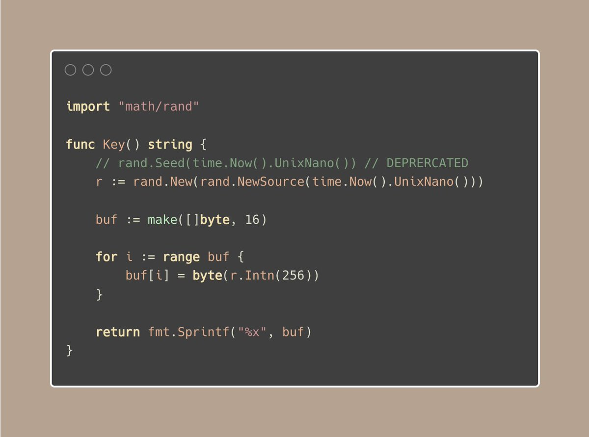

# Tip #12 使用`crypto/rand`生成密钥，避免使用`math/rand`

>  原始链接：[Golang Tip #12: Avoid using math/rand, use crypto/rand for keys instead.](https://twitter.com/func25/status/1754477930531680532)
>

当你所在的项目需要生成一些密钥用来加密或者创建唯一标识的时候，那密钥的质量和安全性就尤其重要了。

### 为什么不使用`math/rand`？

`math/rand`这个包生成的是**伪随机数**。

这意味着如果你知道那些数字是怎么生成的（就是知道用于生成随机数序列的种子），那你就能预知到会生成哪些数字。

就算你使用当前的时间（例如`time.Nanoseconds()`）作为种子，不可预知性（熵）也很低，因为在两次执行之间当前时间并没有太多的变化。

### 为什么使用`crypto/rand`？

`crypto/rand`提供了一个生成密码学安全随机数的方式。

它被设计成无法被预测，使用了你操作系统上提供的更加难以预测的随机数源。

`crypto/rand`适用于加密、认证和其他对于安全敏感的操作。