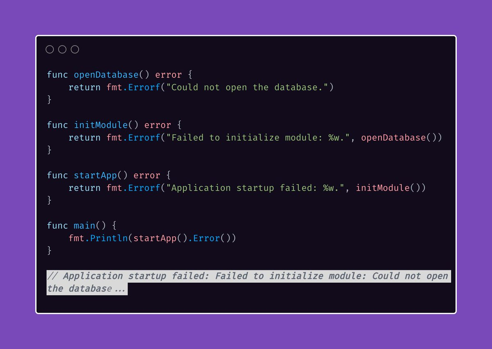

# Tip #14 错误信息不要大写或者以标点结尾

> 原始链接：[Golang Tip #14: Error messages should not be capitalized or end with punctuation.](https://twitter.com/func25/status/1755232851401076925)

这乍看起来有点不寻常，但背后是有实际理由的。

**为什么要小写？**

错误信息经常会被包裹或者合并到其他错误信息里。

如果一条错误信息以大写字母开头，那么当它出现在句子中间的时候，看起来就会很怪或者显得格格不入。

而以小写字母开头会有让它们融合得更加自然。

_// application startup failed: failed to initialize module: could not open the database_

还有个需要关注的点就是关于在消息结尾出现的 `...`。

这意味着，任何跟在格式化错误字符串里 `%w` 后面的文本，都会被添加到整个消息的结尾。

**为什么不要标点？**

这是为了确保当一个消息被追加到另外一个消息后，看起来更像**连贯的句子**，而不是一堆杂乱的短句。
