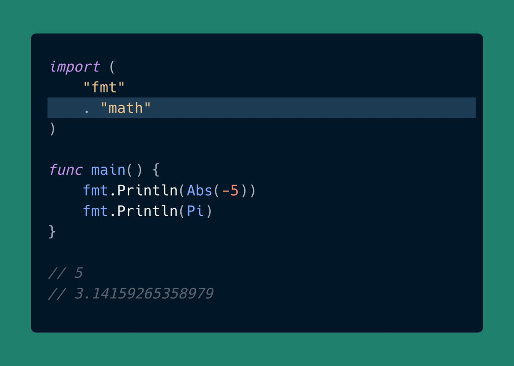
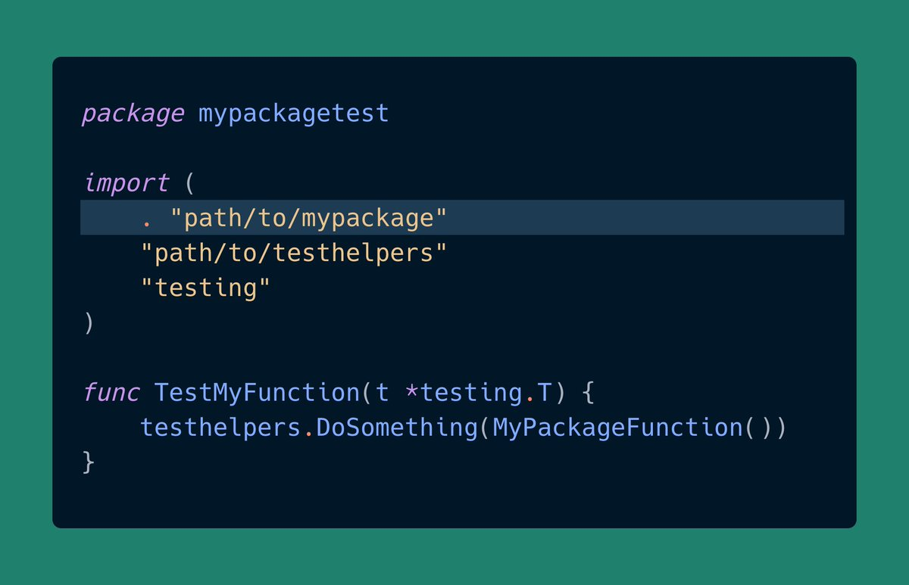

# Tip #15 什么时候使用空白导入和点导入？

>  原始链接：[Golang Tip #15: When to use Dot (.) Import and Blank (_) Import?](https://twitter.com/func25/status/1755544355572765179)
>

## 空白导入（import _ "package"）

当你使用“空白导入”时，你引入了一个包，但并不是为了直接访问它的内容（如函数或变量），而是为了它的副作用。

那么，什么是副作用呢？

副作用是指一个包在被导入时可能执行的任何操作，如初始化、注册、设置环境等。

这通常发生在包的 init() 函数中，该函数在包被导入时自动运行。

即使 main 函数是空的，当你运行上面的代码时，logger 包的 init() 函数会在导入时运行，向控制台打印 “Logger package initialized”。

### 使用时机是什么？

主要规则是：

- 通常在 main 包中使用。
- 在那些需要引入副作用才能正确运行的测试中使用。

一个常见的例子是在使用 database/sql 包的程序中导入数据库驱动包。

数据库驱动包被导入是因为其副作用（例如，将自己注册为 database/sql 的驱动）。

## 点导入（import . "package"）

使用“点导入”有点特别。

这意味着你可以直接使用那些导出的项，就像它们是在当前包中定义的一样。

看，我们不需要指定 math.Abs 或 math.Pi。

### 那么，何时使用它？

这种形式在测试中特别有用。

尤其是在处理难以轻易解决的循环依赖时。

给你举个例子。

想象你有两个包：

- mypackage：这是你的 main 包，包含你正在测试的功能。
- testhelpers：一个提供测试辅助函数的独立包。

其中一个辅助函数需要使用 mypackage，从而创建了从 testhelpers 到 mypackage 的依赖。

现在，你正在为 mypackage 编写测试，并希望使用 testhelpers 中的辅助函数。

但由于 testhelpers 已经导入了 mypackage，你不能简单地将 testhelpers 导入到你的 mypackage_test.go 中，否则会创建循环依赖。

> 译者注：上面隐含了 mypackage_test.go 所在的包是 main 包。

为了解决这个问题，测试文件声明自己为 mypackagetest 包，并使用点导入直接访问 mypackage 的标识符，就像它在 mypackage 内部定义的一样。

建议谨慎使用这两种包导入方式，因为它们可能会使代码更难阅读。