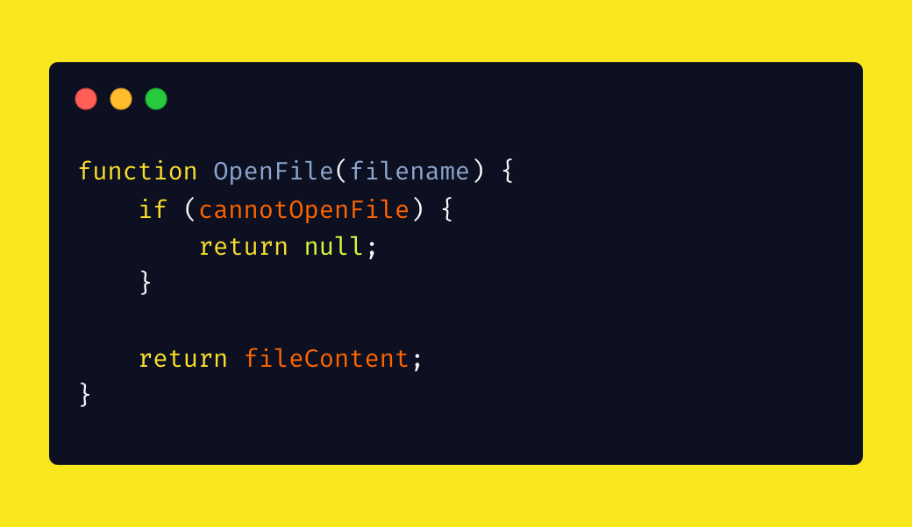
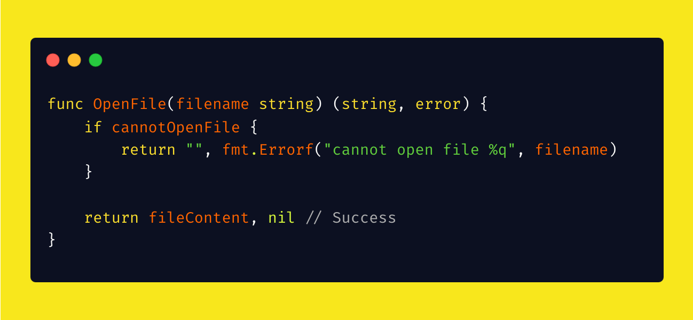
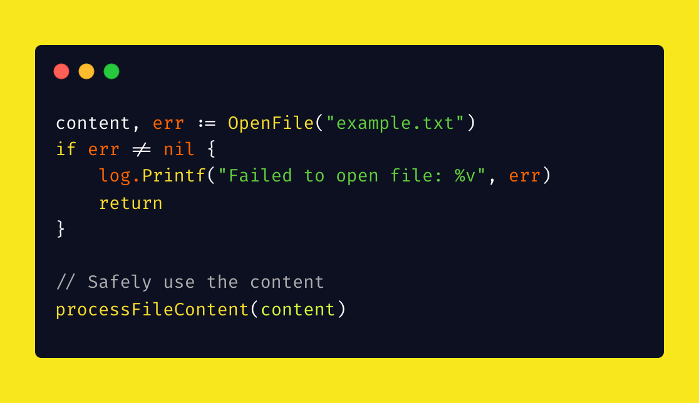

# Tip #16 不要通过返回 `-1` 或者 `nil` 来表示错误

> 原始链接：[Golang Tip #16: Don't Return -1 or nil to Indicate Error.](https://twitter.com/func25/status/1755903433671106993)

在其他语言中，函数通常通过返回特殊值如 `-1`、`null`、`""` 等来表示错误或缺失的结果。

**这被称为“带内错误”（in-band errors）。**

使用 in-band 错误的主要问题是，需要调用者记住每次都要检查返回的特殊值。

但这是...非常容易出错的。

此外，在 Go 中这种方法其实并不是最好的方法（甚至不是好的），因为 Go 可以支持多返回值。

**Go 的解决方案是：多返回值**

函数可以返回其通常的结果以及额外的值（错误或布尔值），明确表示操作是否成功。

这可以使得代码更加清晰。

在不检查表明是否成功的返回值（ok bool）的情况下使用结果会导致编译时错误。

这迫使我们必须明确处理可能的错误：

现在，您的代码便拥有了 3 个优势（您甚至不需要额外关心）：

**明确的关注点分离**

返回值明确的表示了的哪部分是实际结果，哪部分表示操作的成功或失败。

**强制错误处理**

Go 编译器要求开发人员处理错误的可能性，从而降低忽略错误的风险（因此，请勿使用 “`_`” 来忽略错误）。

**提高可读性和可维护性**

代码可以明确地解释自身的行为（documents itself）。
