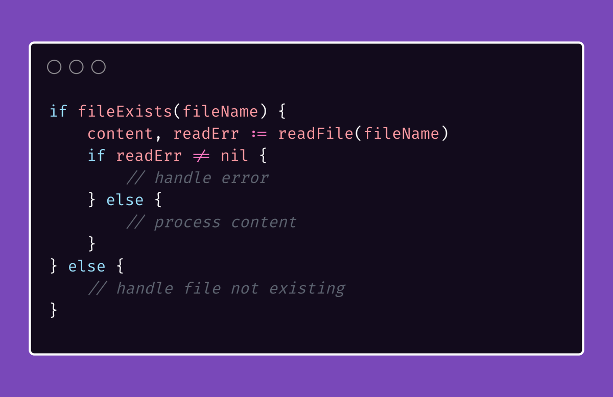
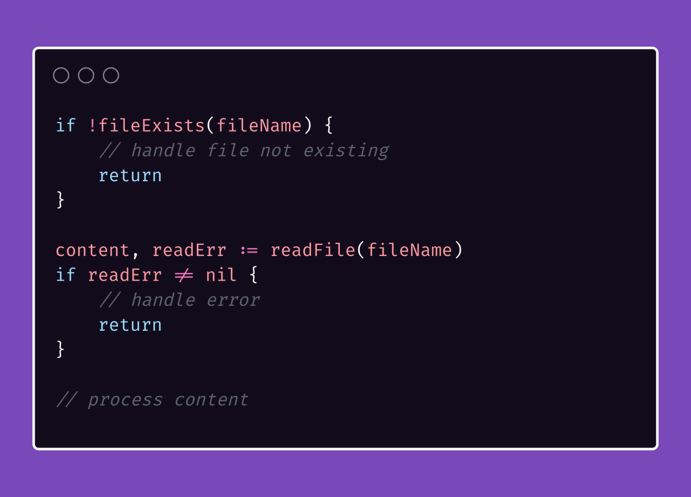
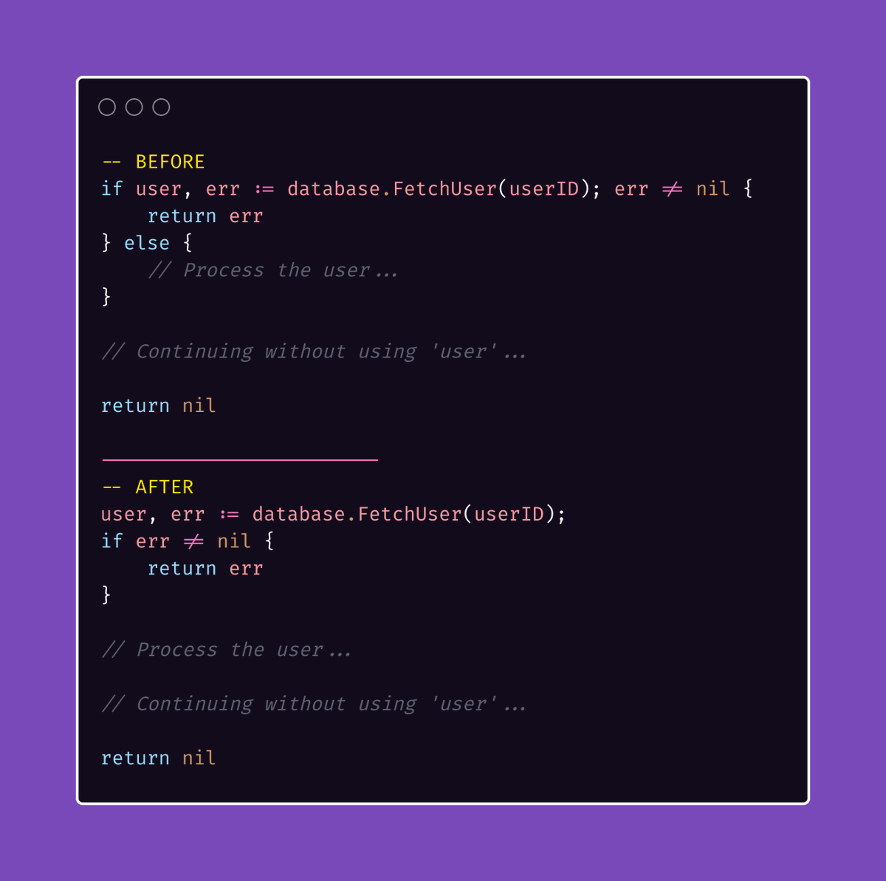
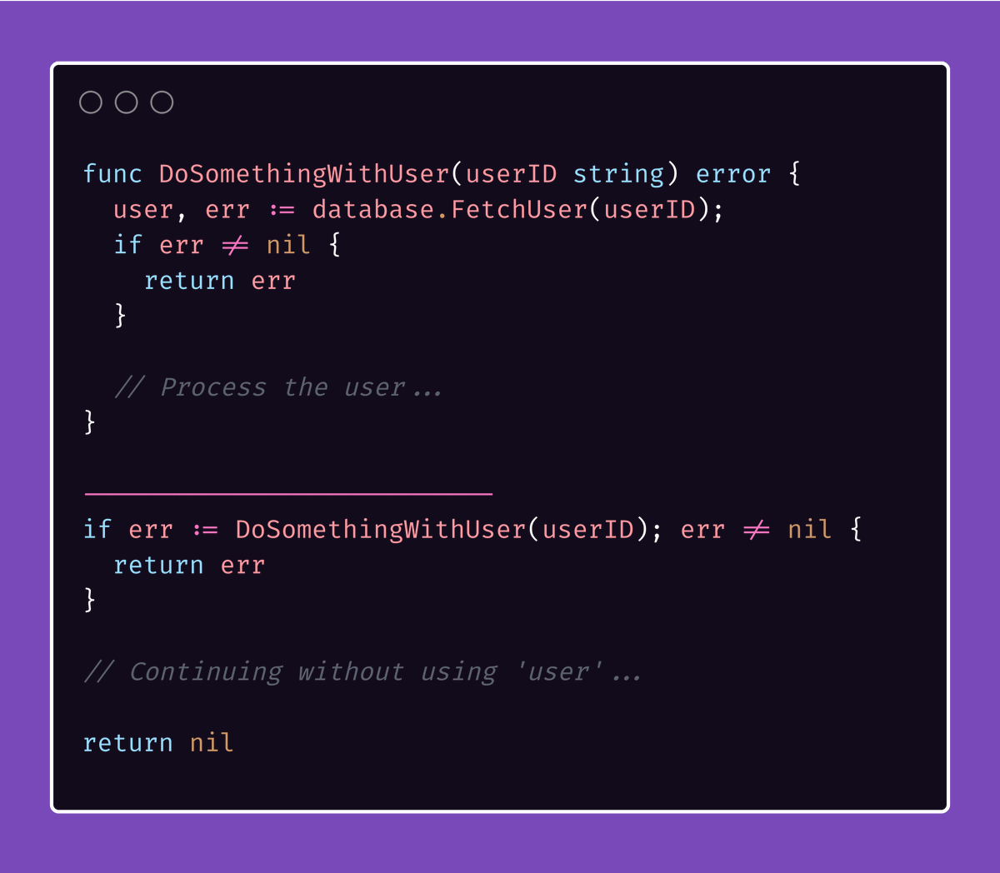

# Tip #17 理解“尽快返回、尽早返回”，避免代码嵌套

>  原始链接：[Golang Tip #17: Understanding "Return fast, return early" to avoid nested code.](https://twitter.com/func25/status/1756271704324845722)
>

当你写代码的时候，你会想让它尽可能的清晰易懂。

要做到这点，其中一个方法就是组织你的代码，让它的“快乐路径”（预期的或者正常的执行流程）更加的突出和简单明了。

举一个（潜在的）反例：

**所以，指导原则是什么？**

很简单：提前处理错误，别让他们碍事。

这意味着当出现一个错误时：

- 立刻处理它。
- 使用`return`、`break`、`continue`等等语句停止当前操作的执行。
- 或者如果可以的话，处理错误时让正常的执行流程可以安全的得到处理。

回到最开始的那个例子，更好的方法是：

> “如果我的方法返回两个值，例如获取`user`返回`(user, error)`，然后值需要在短期内使用呢？”

就算`user`仅仅用在`else`的作用域里，我也建议把初始化和错误检测分开。

这样可以避免深层的嵌套以及可以简化错误的处理。

> “但如果我只是想在`else`的作用域里使用`user`呢？”

如果`user`的使用严格限制在`else`里面，并且不会影响外面的逻辑，那么可能是时候把这部分逻辑封装到一个新的方法里了。

现在我们在`DoSomethingWithUser`方法上使用了这个原则。

当然，并不存在一个“放之四海而皆准”的解决方案。