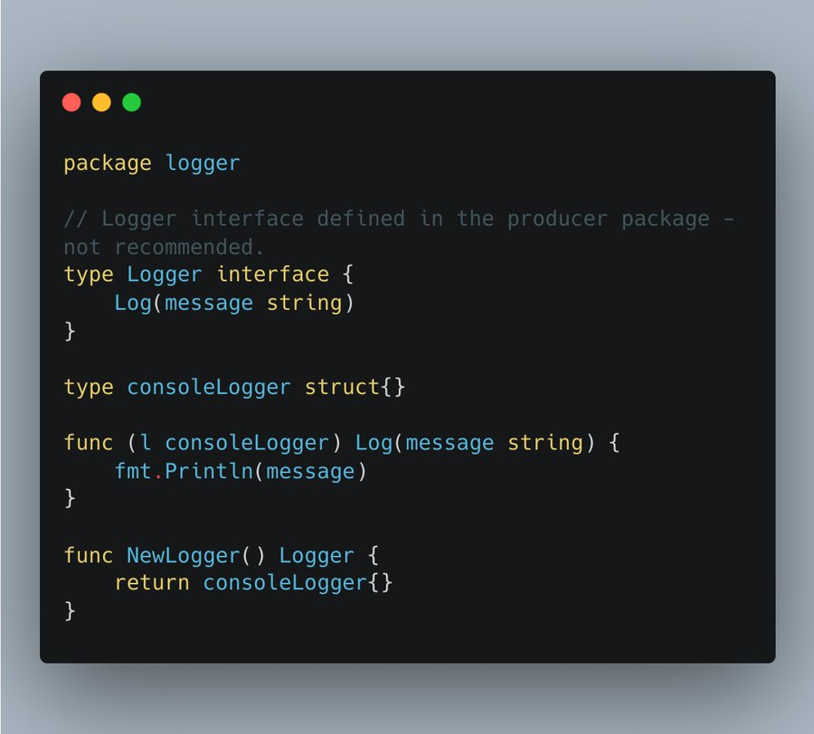
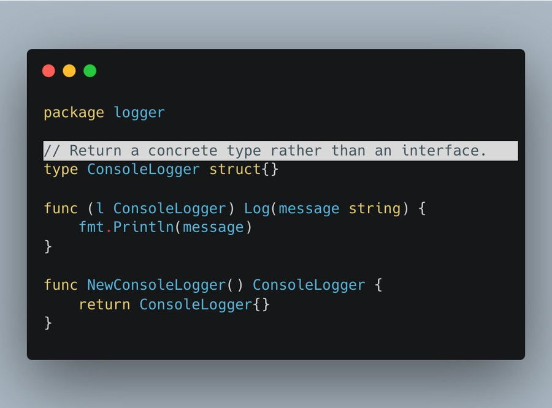
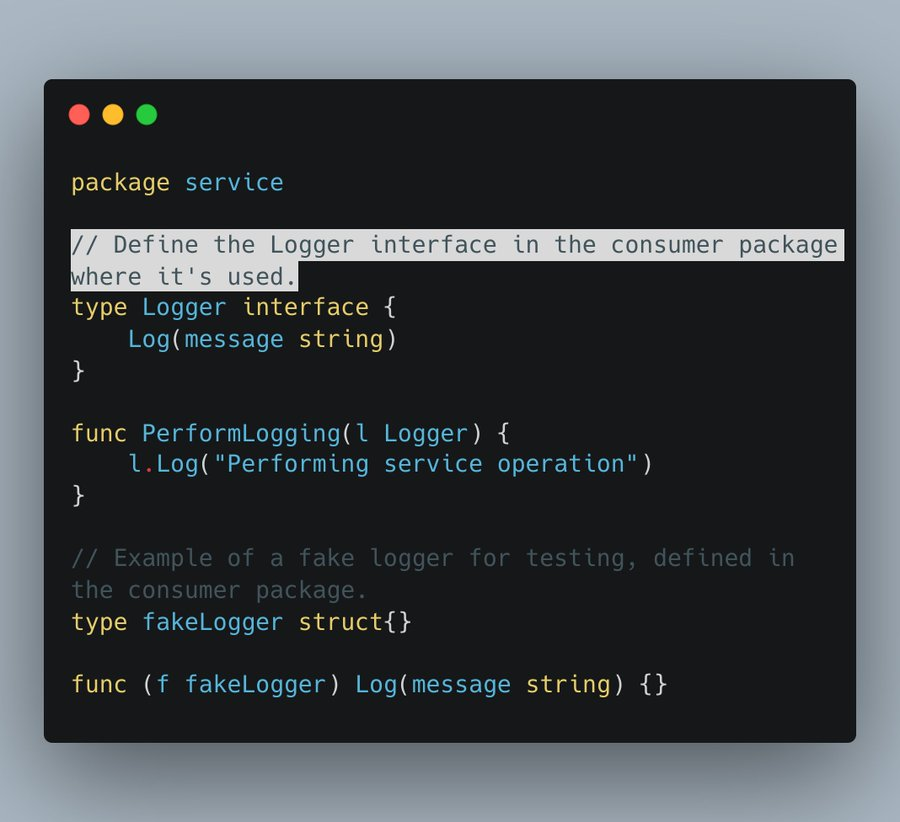

# Tip #18 在使用者的包中定义接口，而不是提供者的包中定义

>  原始链接：[Golang Tip #18: Define interfaces in the consumer package, not the producer](https://twitter.com/func25/status/1756629777107292231)
>

我之前在推特上提到过这个话题（https://twitter.com/func25/status/1738890734349201903），但它的重要性使我把它列入了这个tips的列表里。

现在，有3个原则需要记住：

1. 在使用者的包中定义接口，而不是提供者的包中定义

    接口应该由使用者（使用这个接口的代码）而不是提供者（实现这些接口的代码）来定义。

    这种方法使得添加一个新的函数实现更容易，不会影响到使用者。

2. 在提供者的包中使用具体类型作为返回值

    这很简单，因为我们没有在提供者的包里定义这个接口。

    它允许我们在这些类型上添加新方法，而不破坏这个API。

3. 避免过早定义接口

    只在有明确使用场景下定义接口，确保它们是**必要的**且**设计得当的**。

好了，说够了理论和假设。

你有没有做过类似的事情？

在consoleLogger同一个的包中定义Logger接口。

然后，每当你想使用它时，你在使用者的包中创建接口（？）。

我这么做好多年了，不使用Logger，而是使用库的接口。

> “这么做不好吗？”

可能吧

但是遵循我们原则考虑一下这个方法，让我们修改一下它。

首先，这是我们新的提供者的logger包：

1. 我们不再在提供者的包中保留Logger这个接口了。

2. 在创建一个提供者包中的Logger时，我们返回一个具体类型，对吧？

3. 我们避免过早的定义接口，不需要猜测使用者需要什么功能。

现在让我们看看我们的使用者是如何用它的呢

通过在使用接口的地方(在高级模块中)定义接口，可以确保这些模块依赖于抽象接口而不是具体的实现。

啊，这也可以增强模块化，mock测试和设计思维。