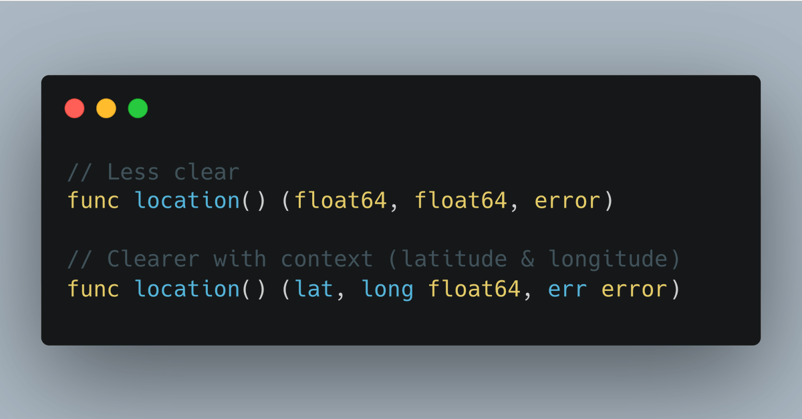
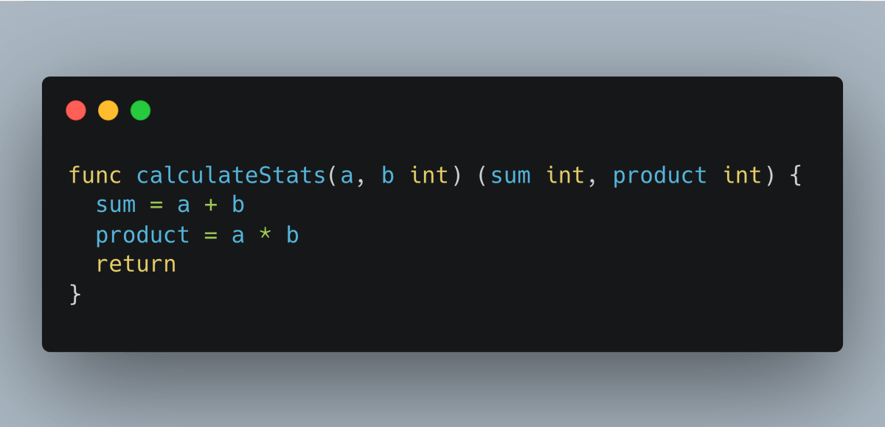
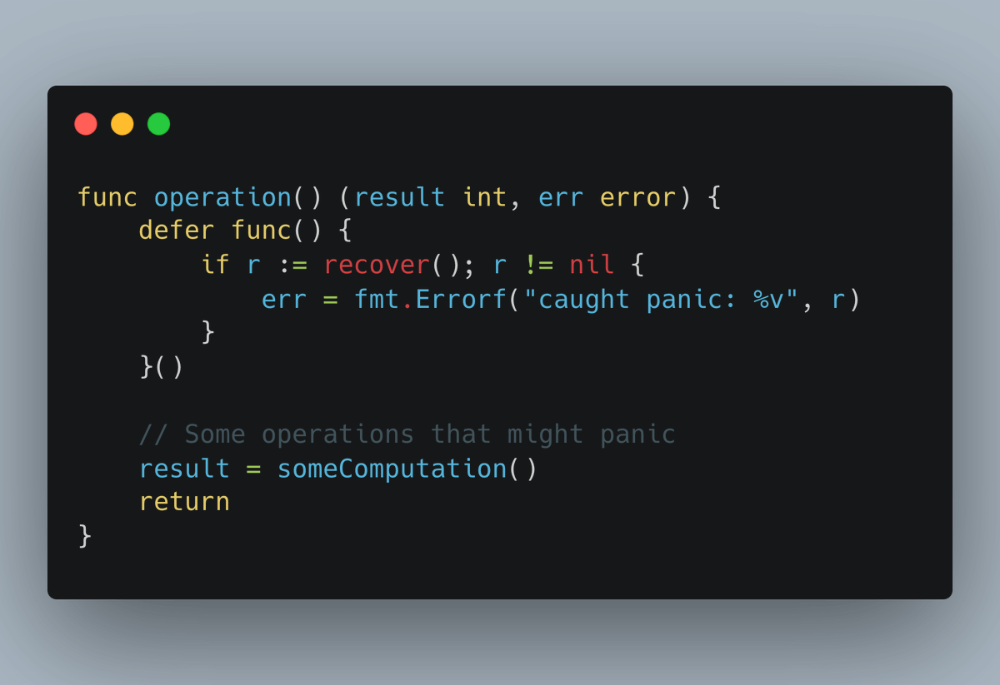
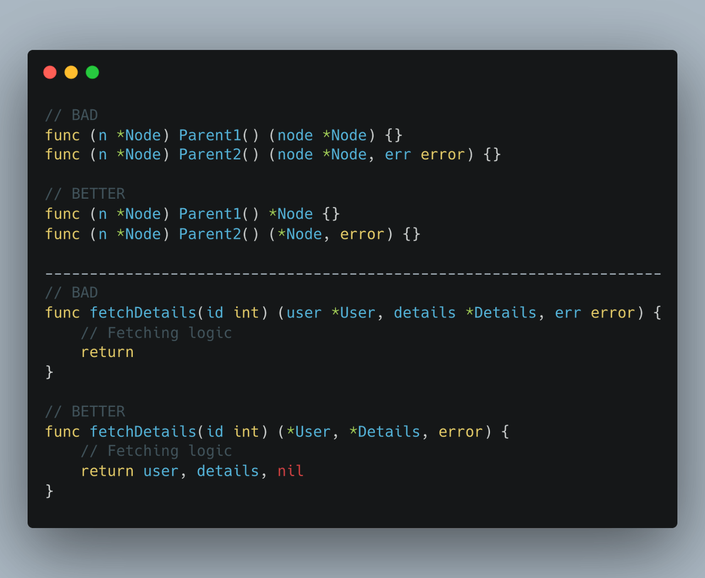

# Tip #19 除非出于文档说明需要，否则避免使用命名结果

> 原始链接：[ Golang Tip #19: Avoid named results unless necessary for documentation.](https://twitter.com/func25/status/1757024709605265674)

**注意**：个人而言，我总是避免使用命名结果，因为它们会鼓励使用裸露返回语句。

命名结果可以在源代码及生成的文档中增强代码可读性，如 godoc、pkgsite（http://pkg.go.dev）。

但了解何时使用它们至关重要，以下是一些关键要点：

## 必要时进行澄清

**建议**：

- 如果函数返回多个同类型值，使用命名结果。
- 若其用途不明显，为清晰起见应为其命名。

**不要**

- 仅仅为了避免在函数内部声明变量而使用命名结果。
- 为了避免反复书写 `return nil, err`，而倾向于简单地使用 `return`。

## 长函数中避免使用裸露(naked)返回

人们常常对裸露返回持谨慎态度，因为它们可能导致代码可读性降低并影响清晰度。

但在短小的函数中，它们完全是可以接受的：

一眼即可明了其意图，在较长函数中则应避免使用。

为保持代码可读性，与命名结果结合使用时，您有权选择是否使用裸露返回。

## 对于延迟闭包是必要的

若需在延迟函数调用中修改返回值，为结果参数命名至关重要。

此处为结果参数赋予名称 `result` 和 `err` 具有特定目的。

这使得这些变量在延迟闭包内可访问，从而根据函数执行结果或针对 panic 进行相应修改。

## 即使在返回多个结果的情况下，有些情况也不必命名

当函数返回相同类型的对象时，特别是在某一类型的成员方法中，为每个返回的对象命名可能会造成冗余，并使我们的文档显得杂乱。

或者，该类型本身可能已经具有自解释性。
`
