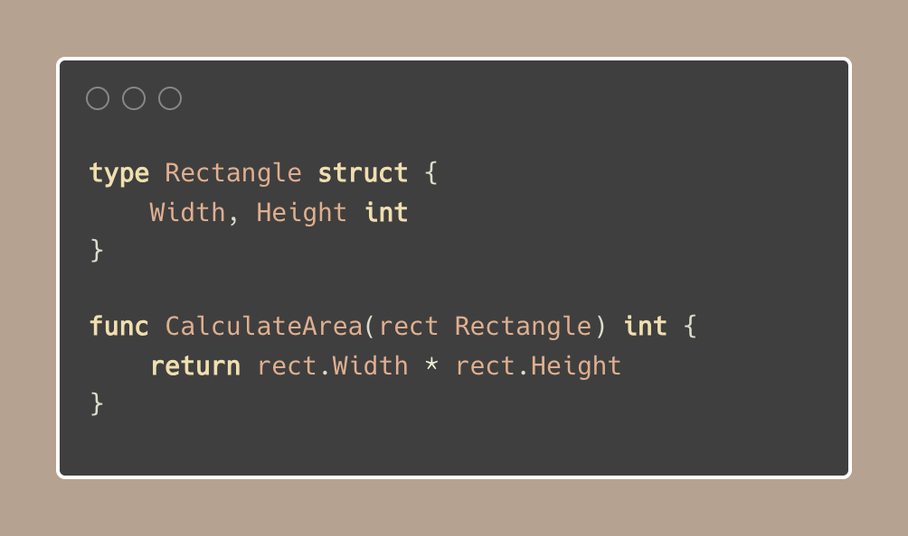
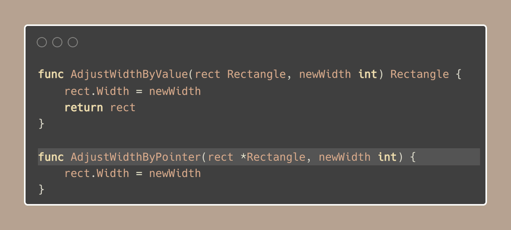

#  Tip #20 传递值，而不是指针

>  原始链接：[Golang Tip #20: Pass values, not pointers](https://twitter.com/func25/status/1757387675085279437)
>

这是我们在刚开始接触 Go 时绊倒了许多人（包括我自己）的一个话题。

很多时候，出于以下几个原因，我们会倾向于在函数中传递指针：
- 我们试图避免复制结构体时带来的开销。
- 或许是因为我们已经有了一个指针，感觉为了传值而去解引用它显得多余（`*T`）。

** 0. 关于指针的常见观念**

人们普遍认为这是一种节省内存的巧妙方法。

既然可以通过传递一个小巧的地址（指向数据存储的位置）代替复制所有数据传递给函数，何乐而不为呢？

但是建议是**优先直接传递值给函数**，而不是传递指针。

为什么呢？以下是关于何时应该传递值的5个关键点。

**1. 固定大小的类型**

这里我们讨论的是整数、浮点数、小型结构体以及（小型）数组。

这类类型的内存占用是固定的，通常在很多系统上与指针的大小相当，甚至更小。

**2. 不变性和清晰度**

传递值意味着函数接收到一份数据的副本，不受外部影响。

这样，你无需担忧意外的副作用，因为任何改变都将局限于函数内部。

同时，传递指针意味着你在向团队传达这样一个信息：“我不会改动你的原始数据，我只是需要操作这份数据”。

这种方法清晰且安全。

两个例子都被认为是好的。

如果你想在调用的函数内部改变值，当然可以通过指针来实现。

**3. 小型或不太可能增长的类型**

对于本质上较小或不太可能显著扩展的数据类型，直接传递可以避免解引用指针的额外步骤。

** 4. 传递值的速度很快，而且很少比传递指针慢**

这可能会因为复制而显得有悖常理，但原因如下：
- 复制少量数据非常高效，通常比使用指针时所需的间接操作更快。
- 当值直接传递时，垃圾收集器的工作量会减少，因为它需要跟踪的指针引用更少。
- 通过值传递的数据在内存中往往存储得更紧密，这使得CPU能够更快地访问数据。

你很少会遇到一个足够大的结构体，以至于通过指针传递对其有利。

** 5. 将传递值设为默认值**

只有在基准测试显示指针传递有明显优势时，才考虑使用指针。

一点点性能提升通常不值得牺牲清晰度。

当然，指针可以加速大型或不断增长的（无界的）结构体的处理速度，但你必须证明这是值得的。
