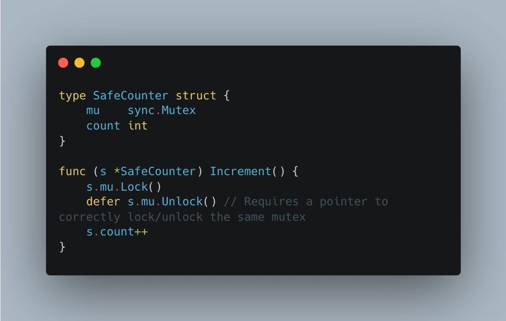

# Golang Tip #21: 定义方法时，优先使用指针作为接收器(receiver)

> 原文链接：[Golang Tip #21: Prefer using a pointer receiver when defining methods.](https://twitter.com/func25/status/1758085077211443304)
>

在继续之前，这里有一个关于指针接收器与值接收器的简短介绍：https://twitter.com/func25/status/1757759982354026636

在Go中，规则并非是非黑即白的：“使用指针接收器进行修改，否则使用值接收器”。

一些指导原则：

何时选择指针接收器？

- 修改接收器的状态时
- 对于被认为是“大型”的结构体。这可能有点主观，就像我之前的推文中提到的那样
- 当结构体包含同步字段时，例如sync.Mutex，选择指针可以避免复制锁

- 如果不确定，选择指针接收器是比较明智的选择

何时适合使用值接收器？

- 小型且不会被改变的类型
- 如果你的类型是 map、func、channel，或者涉及到切片，而且切片的大小和容量不会改变（尽管元素可能会改变）

> “为什么切片的大小和容量不会被改变？”

尽管你可以通过值接收器修改切片的元素或底层数组的内容（影响原始切片），但调整切片的大小（例如，使用append来增加容量）不会影响方法外部的原始切片。

这里有一个例子：
https://twitter.com/func25/status/1731181436282208375

最后，一致性至关重要。

避免在给定结构体中混合使用不同的接收器类型，以保持一致性。

如果任何方法因为需要进行修改而使用指针接收器，通常最好为该结构体的所有方法都使用指针接收器，即使其中一些方法并不会引起修改。

我想到的主要理由有：

- 混合使用两种接收器可能会导致对该结构体进行操作时出现混乱和不一致，尤其是在更改接收器类型时
- 为了保持对象与接口的交互一致和简单（更多详情，参考我之前在 4/4 部分的推文）