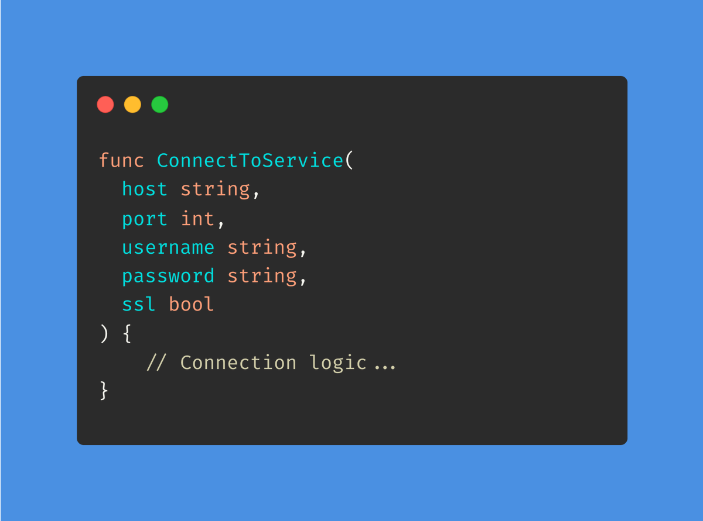
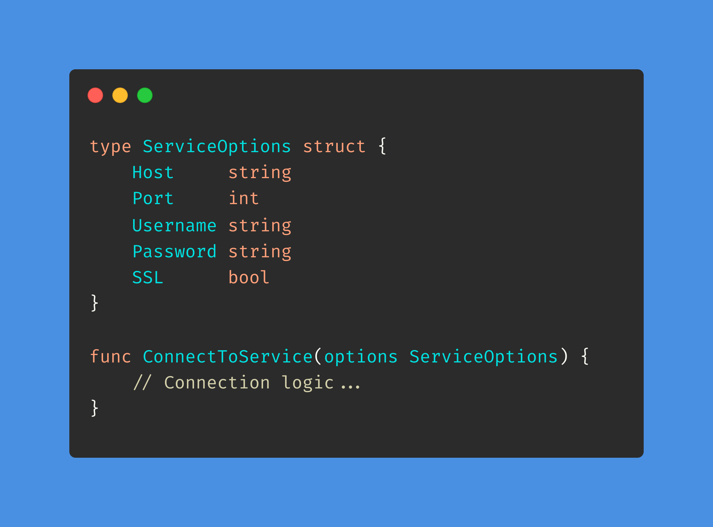
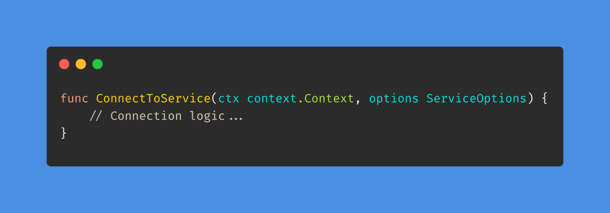
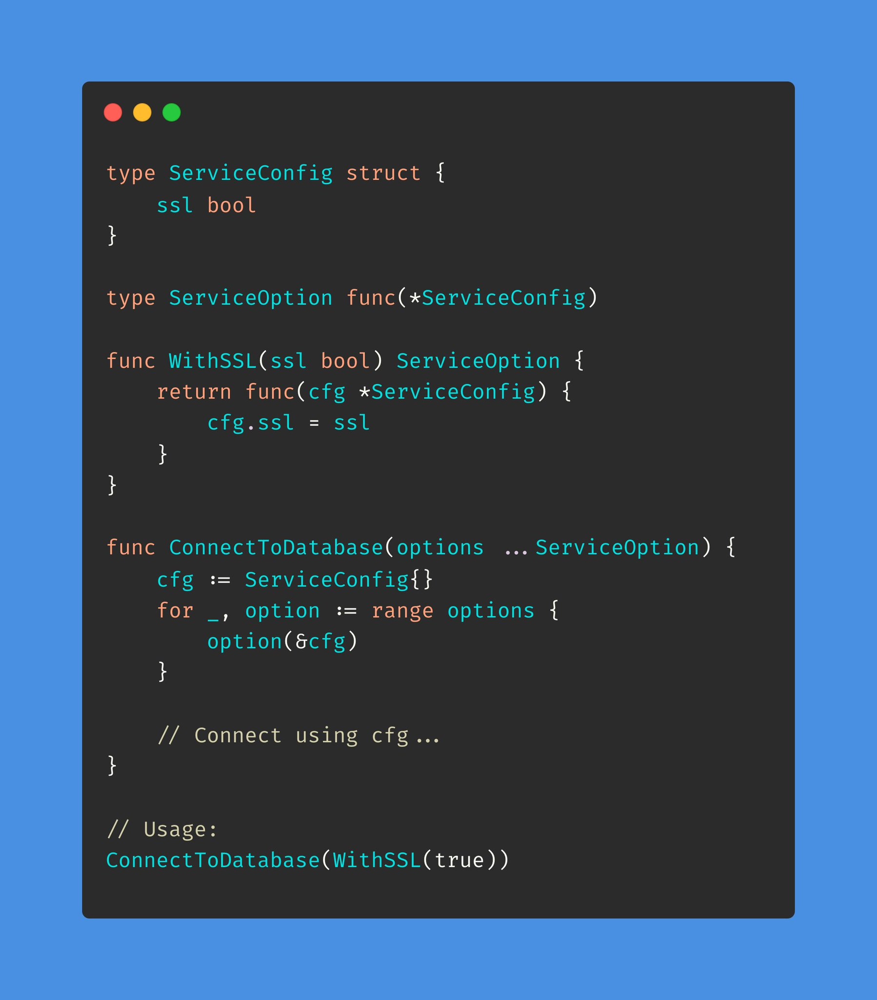

# Tip #22 使用结构体或变长参数简化函数签名

> 原始链接：[Golang Tip #22: Simplify function signatures with structs or variadic options](https://twitter.com/func25/status/1758435261183353308)

在 Go 语言中设计函数时，会遇到需要传递大量参数的情况。

这会使得函数不够简明，代码难以维护，尤其是多个参数类型相同时。

为了保持代码整洁，可以考虑以下两种策略：

- 结构体作为参数
- 变长参数

### 1. 结构体作为参数

将你的参数放入结构体中，不仅增加代码可读性，还使传参更方便。

什么时候使用结构体作为参数？

- 你的函数具有冗长的参数列表。
- 你的目的是编写自文档化的代码，因为结构体字段名本身就对其功能具有描述性。
- 你希望方便的为函数参数设置默认值或灵活的修改函数参数。

当使用这种模式时，将`context.Context`作为单独的参数，而不是将其放到结构体中。

这是因为`context.Context`在控制请求作用域的值、截止日期和取消信号方面扮演着独特的角色。

不过在使用结构体作为参数时，这里有些小的技巧：

- 保持结构体向后兼容性，当我们添加新字段时，不会破坏之前的任何功能。
- 在结构体被使用之前，我们总是能对其进行校验。
- 考虑隐藏结构体（设置成不可导出），通过暴露 NewXXX()函数来给结构体赋默认值。

### 2. 变长参数

这种方法利用 Go 函数的能力，允许你以更简洁的方式传递不定数量的参数。

非常适合下面的情况：

- 函数需要高度可配制。
- 大多数参数是可选的或很少用到。
- 你喜欢简洁的函数调用。

变长参数设置参数默认值比使用结构体作为参数更方便，你不需要隐藏它，直接在 ConnectToDatabase 函数中设置默认值即可。
