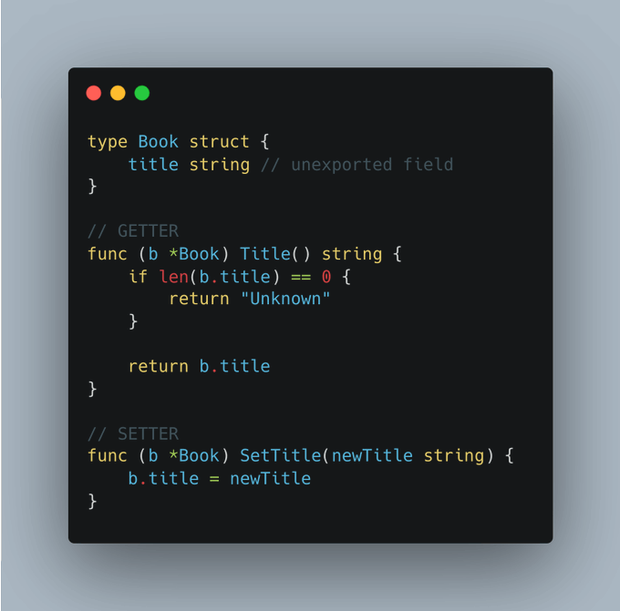

# Tip #23 省略 getter 方法的'Get'前缀

>  原始链接：[Golang Tip #23: Skip the 'Get' prefix for getters](https://twitter.com/func25/status/1758798018227441764)
>

在编写代码时，我们通常以动词开头给函数命名，比如 get、set、fetch、update、calculate 等等...

但是在Go语言中 getter 方法是一个例外。

> “为什么需要 getter 和 setter 方法？”

在 Go 语言 中，封装是通过方法的可见性和命名约定来实现的，这巧妙地支持了封装，而不需要严格使用 getter/setter 方法。

然而，如果需要额外的逻辑，或者我们想要访问一个计算字段，手动定义 getter 和 setter 方法也是没有什么问题的。

> “定义 getter 名称的惯用方法是什么？”

惯用的方法是简单地使用字段的首字母大写作为 getter的名称（以便将其导出）：

另一个示例涉及提供计算属性或配置的方法，这些属性或配置并**不直接作为字段存储在结构体**中：

