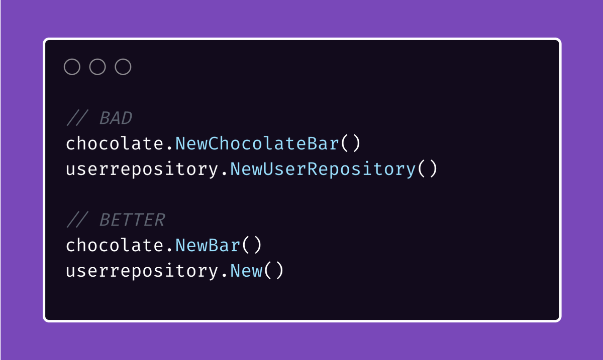
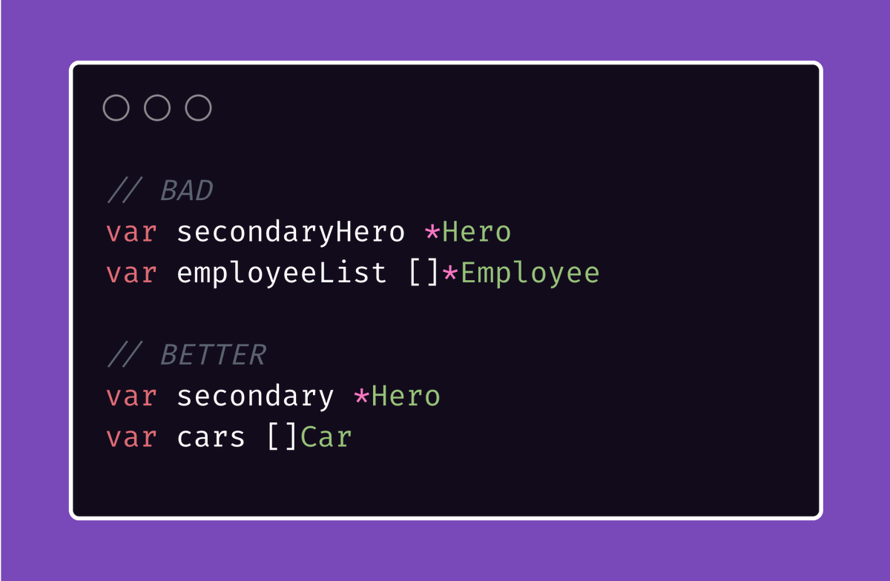
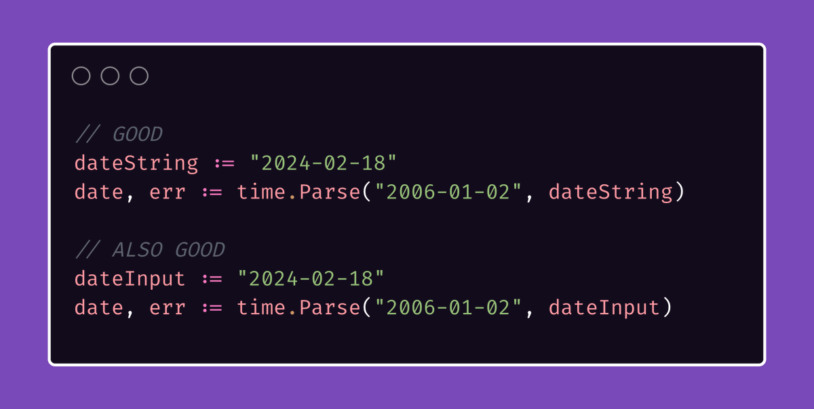
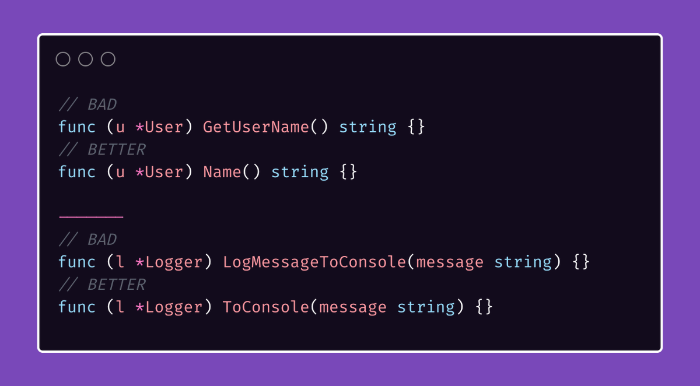
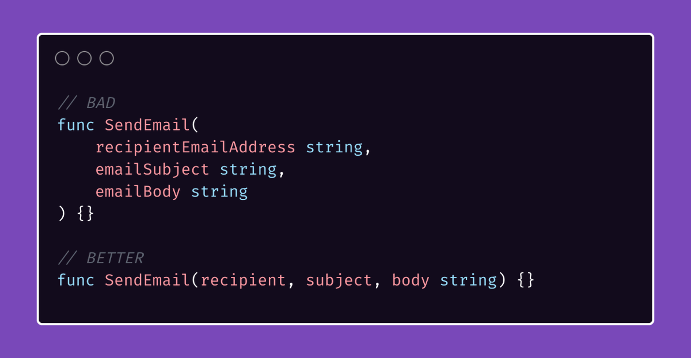
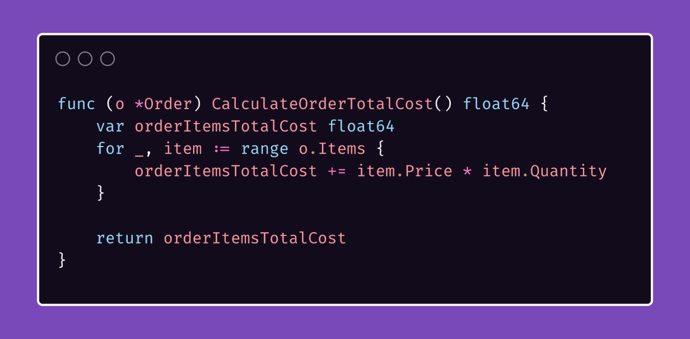
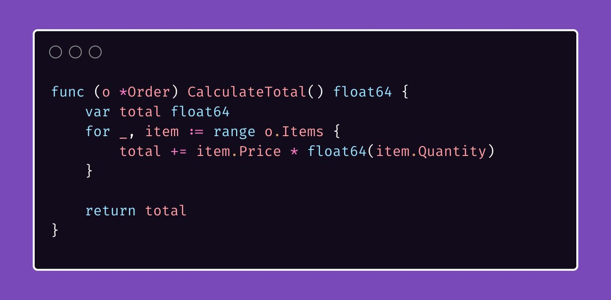

# Tip #24 避免命名中的重复

>  原始链接：[Golang Tip #24: Avoid repetition in naming](https://twitter.com/func25/status/1759196416961032620)
>

## 1、包名与导出符号名称
在为对外可见（即在包外可见）的元素命名时，应避免重复使用包名。

否则，由于在包外使用这些符号时包名已经可见，会导致名称过长且更为重复：

这个“改进版”消除了重复。

当我们使用它时，语义自然：`chocolate.NewBar()`，清晰地创建了一个新的巧克力棒，没有冗余。

## 2、变量名与类型
我们通常不需要在变量名中重复其类型。

通常从上下文或使用方式即可清楚得知。

然而，存在一些例外情况，应当予以考虑。

如果你同时拥有 `[]Car` 和 `map[string]Car`（可能是出于快速查找的目的），那么为了清晰起见，可以这样做。

“但如何命名呢？carList 和 carMap？”

`CarList` 和 `carMap` 是不错的解决方案。

但我们可以通过指出数据的形式或状态使其更清晰，如：`[]Car cars` 和 `map[string]Car carLookup`

以下为另一个示例：

在第二种方案中，显而易见其为字符串和输入值。

## 3、避免重复归结于“上下文”
迄今为止我们讨论的所有内容都归结于“上下文”
- 包名
- 方法名
- 类型名
- 文件名

这些应指导你选择既简单又具有信息性、避免不必要的重复的名称。

接下来讨论一些与“上下文”相关的其他情况：

- 带有类型名的方法：

- 函数及其参数：

- 在函数内部，特别是在处理与函数目的密切相关参数或数据时，以一个不好的示例为例：

- 我们将函数名和局部变量名都进行重命名：

