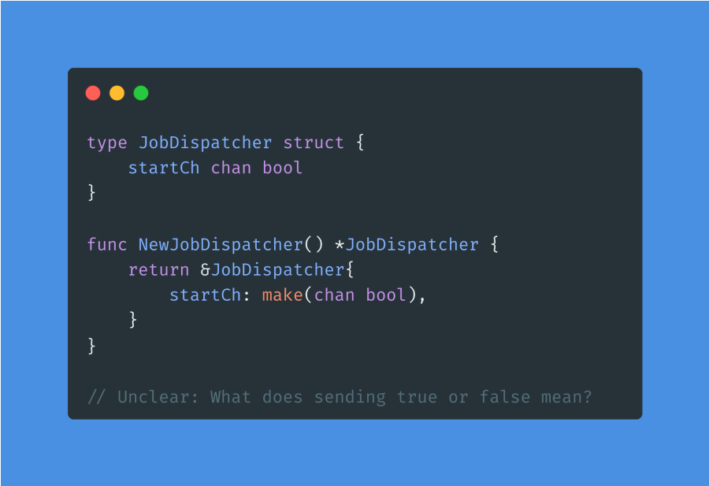
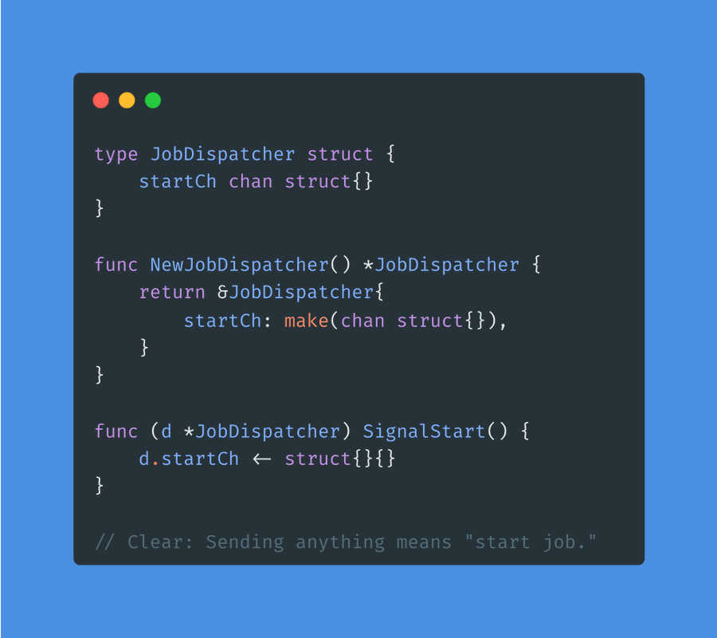

# Tip #25 在 goroutines 之间进行信号传递时，使用 'chan struct{}' 而不是 'chan bool'

>  原始链接：[Golang Tip #25: Prefer 'chan struct{}' over 'chan bool' for signaling between goroutines.](https://twitter.com/func25/status/1759526542877839447)
>

- **chan bool:** 也可以用作信号传递，但是传递的信号为布尔值（true 或 false），表达的意义可能不太清晰。
- **chan struct{}:** 存粹用作信号传递，因为 struct{} 类型不占用内存。

> "为什么倾向于选择 'chan struct{}'"

考虑一个使用 'chan bool' 的例子：

这样的用法可能会令人困惑：我们应该发送 true 还是 false 来停止？

选择 chan struct{} 意味着，”我只对发生的事件感兴趣，而不关心传递的数据是什么。“

所以，使用 chan struct{} 有 2 个（主要的）优点：

- 由于 struct{} 不占用内存，通过 'chan struct{}' 不会在 channel 之间传递任何数据，只传递一个信号通知（一种微妙的内存优化手段）。
- 当开发者看到代码中的 'chan struct{}'，可以立刻清楚的知道这个 channel 是用于信号传递的，从而减少了歧义。

使用 chan struct{} 的缺点可能是有些笨拙的 "struct{}{}" 语法。

这种解决方案防止出现本应用于**信号传递**的 channel 被用于数据传输的情况。