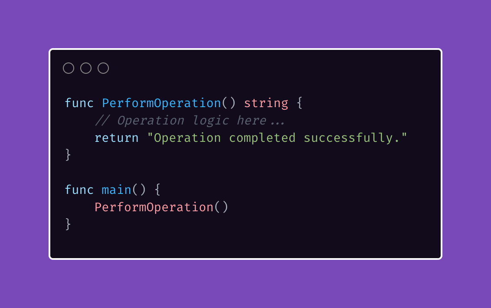

# Tip #25 使用空标识符（`_`）明确忽略值，而不是无声地忽略它们

> 原始链接：[Golang Tip #26: Explicitly ignore values with blank identifier (\_) instead of silently ignoring them](https://twitter.com/func25/status/1759900581315870883)

在编写 Go 语言代码时，函数可能会返回一些你可能想使用也可能不想使用的值。

在这种情况下，有两种处理方式：

- 隐式：调用函数但不将其返回值分配给任何变量，这种方式简短且简洁。
  

- 显式：稍显冗长一些，通过将返回值分配给空标识符 `_` 来显式地忽略它。

> “为什么即使显式方式更冗长且不如隐式方式简洁，我们仍然更倾向于使用它呢？”

在编程中，清晰性总是优于简洁性。

这种显式方式清楚地表明我们有意忽略了 `PerformOperation()` 的返回值。

使用 `_ =` 向其他开发者（或我们自己在不久的将来）发出信号，表明这种省略是故意的，而不是疏忽。

> “那错误怎么办呢？”

无论如何，如果函数返回一个错误，一定要处理它，或者至少记录它。

同时，为了更好地提高清晰性，可以考虑添加注释来解释原因。
