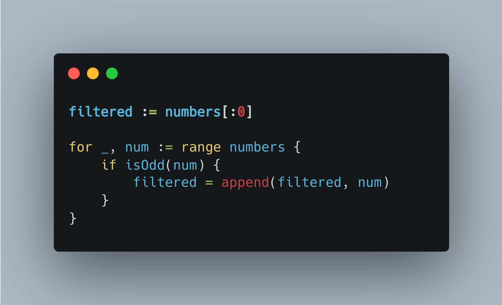
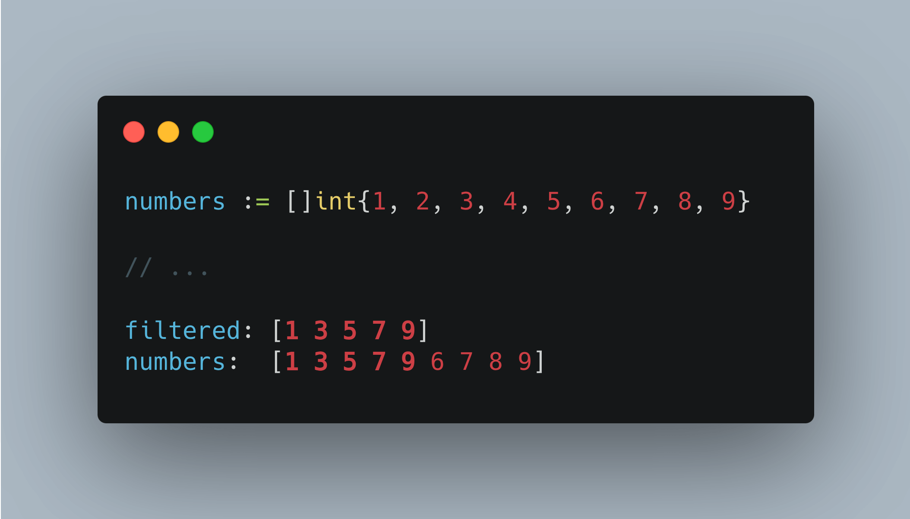

# Tip #27 原地过滤

> 原始链接：[Golang Tip #27: Filter without any allocation.](https://twitter.com/func25/status/1760288508600590594)

在 Go 语言中，通常的做法是为过滤后的元素创建一个新的切片。但是，这种方法会导致额外的内存分配。

更聪明的方法是利用原始切片的底层数组, 在原地切片过滤, 操作方式如下：

- `filtered := numbers[:0]` 创建了一个新的切片 `filtered`，它与 `numbers` 共享底层数组，但长度为零，同时保留了 `numbers` 的容量。
- 当我们将 `num` 添加到 `filtered` 中时，我们避免了额外的内存分配，因为我们实际上是修改了 `numbers`（或者是 `numbers` 的底层数组）。

因此，我们没有分配新的内存，而是在现有数组上进行修改。

记住，这种技术最适用于以下情况：

- 在过滤后不再需要 `numbers` 切片。
- 性能至关重要，特别是在处理大型数据集的时候。
