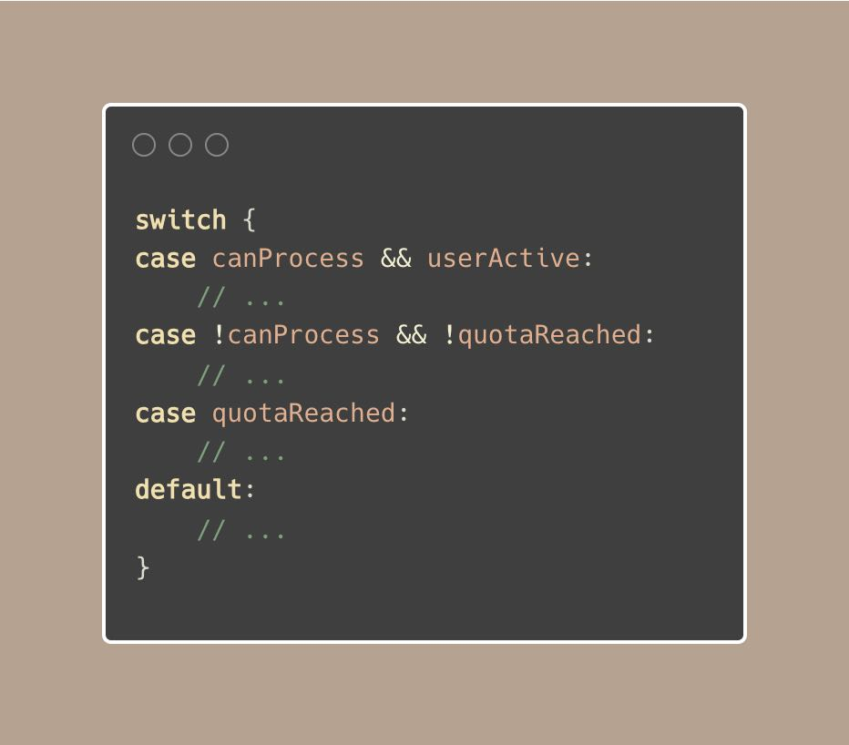
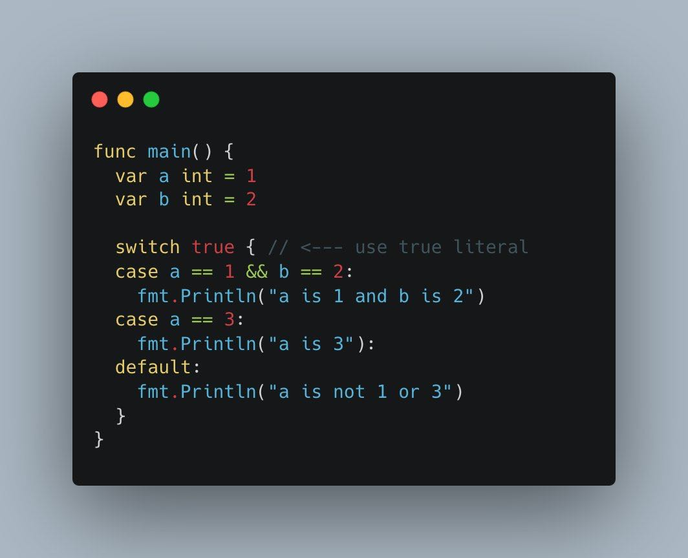
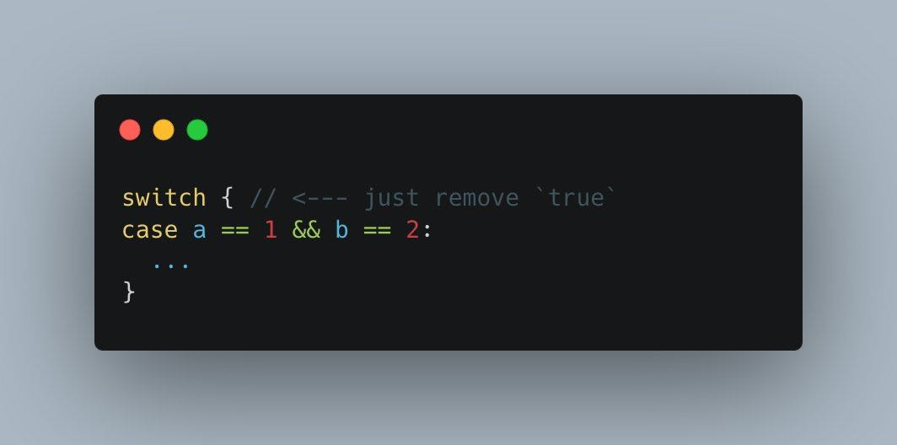
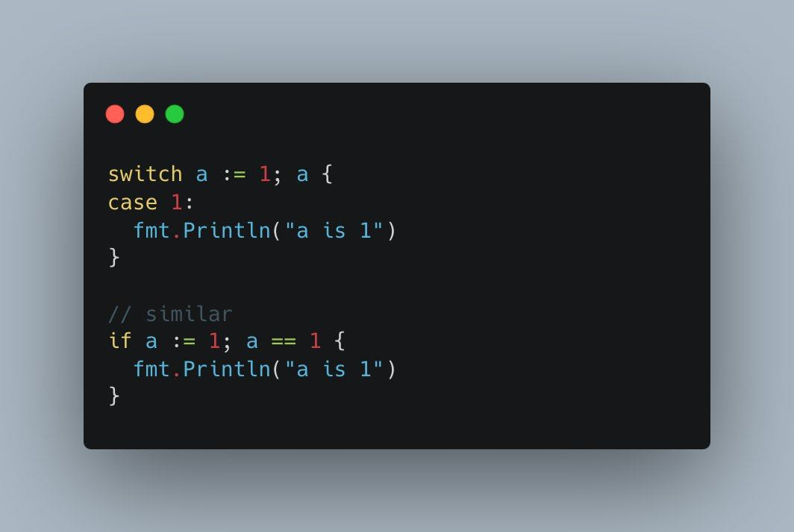
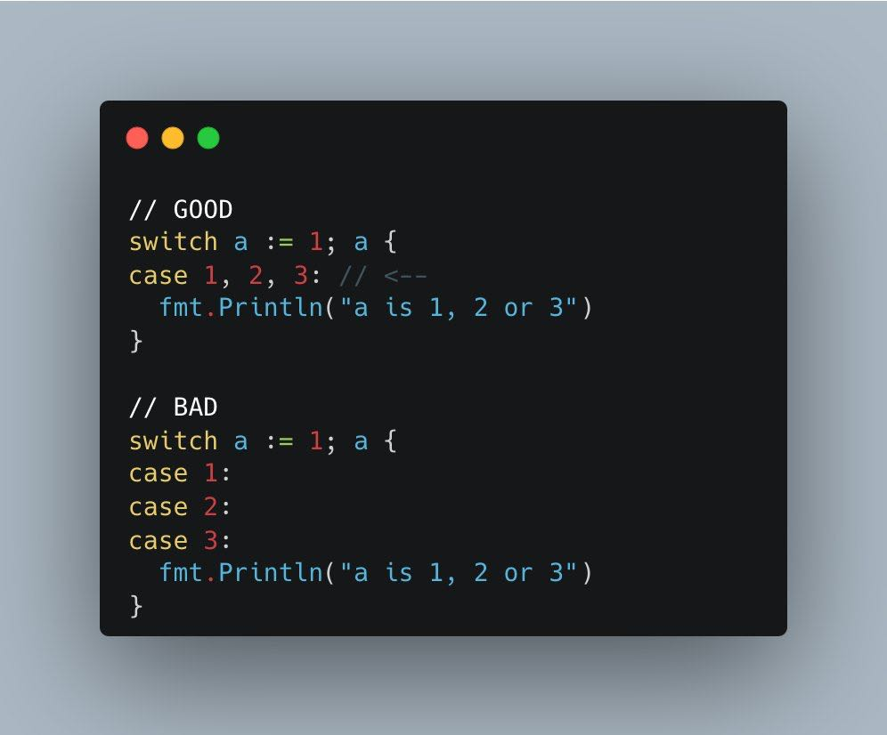
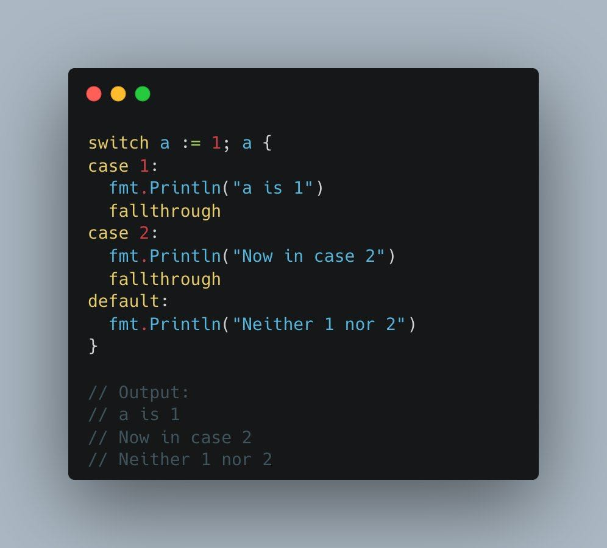
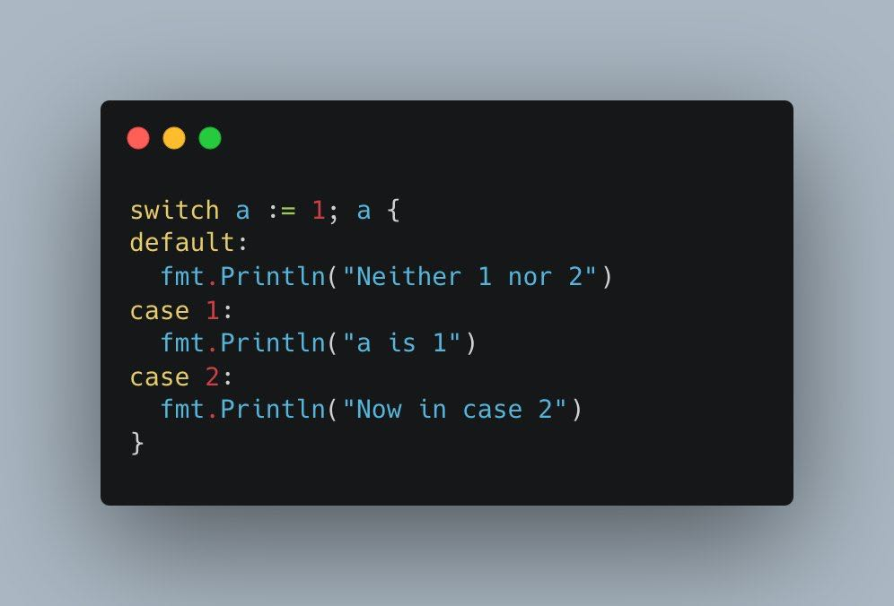
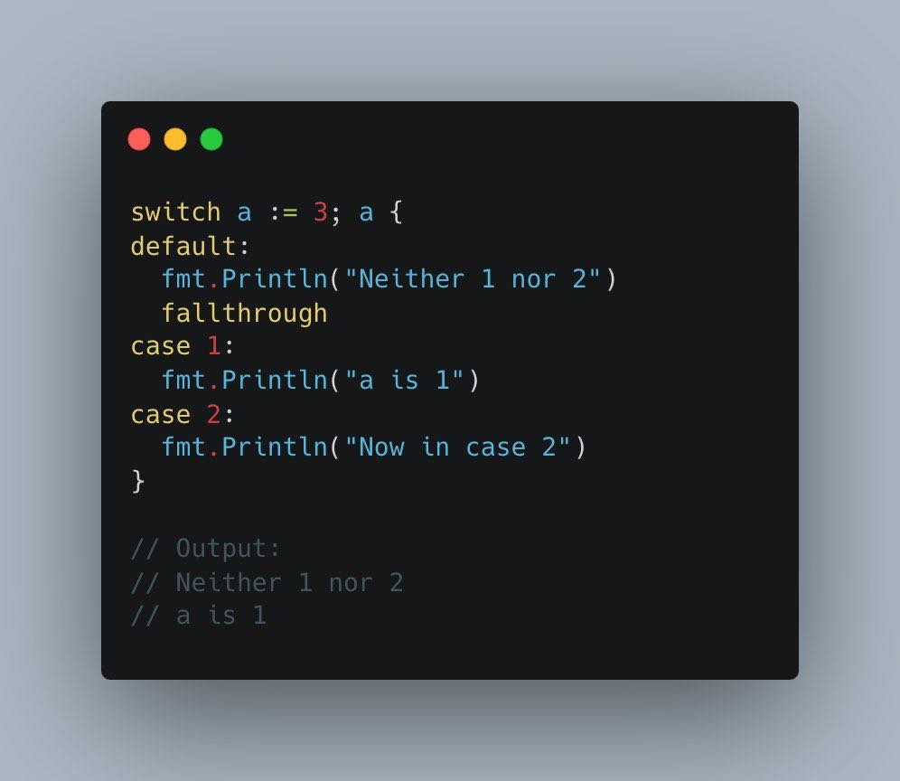

# Tip #28 将多个if-else语句转换为switch

>  原始链接：[Golang Tip #28: Converting multiple if-else statements into switch cases.](https://x.com/func25/status/1760648317942600114?s=46)

通过多个if-else语句处理复杂的条件逻辑是很常见的：

这种方法并没有错。

但是有一个更简洁、更易读的替代方案：将if-else转换成switch语句

首先，我们应该了解 switch-case 结构是如何工作的：

我们可以忽略“初始化”，也可以忽略“表达式”。 当我们这样做时，我们本质上是在写：switch true {}，但 true 是隐式的

随后，回到我们的例子，让我们用我们刚刚讨论的内容来增强它：

这个技巧实际上是作者之前发过的推文的一部分，但还没有提供用例：[twitter.com/func25/status/…](https://x.com/func25/status/1745774945920245800?s=46)

我将上面部分的技巧也翻译出来,如下:

在 Go 中使用 switch 的 6 种方法 🧵

Go 以其简洁而闻名，但我注意到并不是每个人都熟悉 switch 语句在这种语言中的通用性。

1. 用文本布尔值进行切换

感觉有点像我们在陈述显而易见的事情，但好消息是 Go 有一种更简化的方法来处理这个问题，你实际上可以像这样简化它：

2. 切换短分配(其实这里我也不确定是不是翻译成这个比较好)

通常，我们会忽略 switch 语句中的初始值设定部分。

但它非常有用，其工作方式与 if 语句或 for 循环中的初始值设定项类似。

3. Case具有多个值
   
标题显示了方式，您可以在单个case中对多个值进行分组。

4. Case中带有 fallthrough 关键字

该关键字允许继续执行后续case，而无需检查其条件。

这与大多数语言处理 switch case 的方式有点不同。

5. default case及其细微差别

尽管在大多数编程语言中，default case通常位于末尾，但在 Go 中，它可以放置在 switch 语句中的任何位置。

如果我们将default case与fallthrough关键字混合在一起使用会怎么样？

1. 使用类型断言进行切换

switch 语句不仅可以处理值，还可以处理类型。

这是作者关于这篇文章的总结。 如果想订阅作者的每周通讯或了解更多详细信息，请访问：[blog.devtrovert.com](https://blog.devtrovert.com/p/switch-in-go-6-ways-to-use-it)