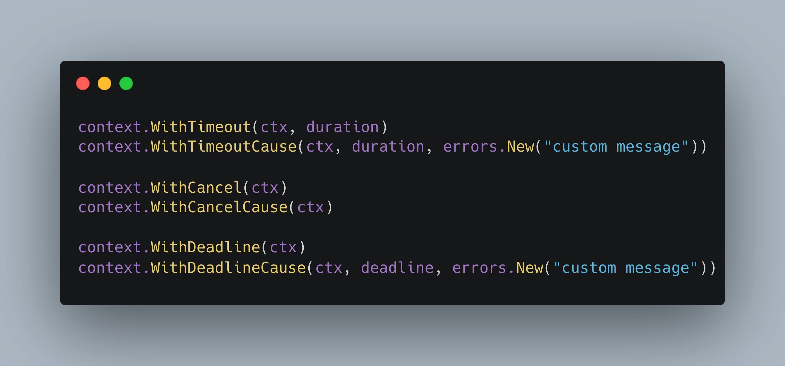
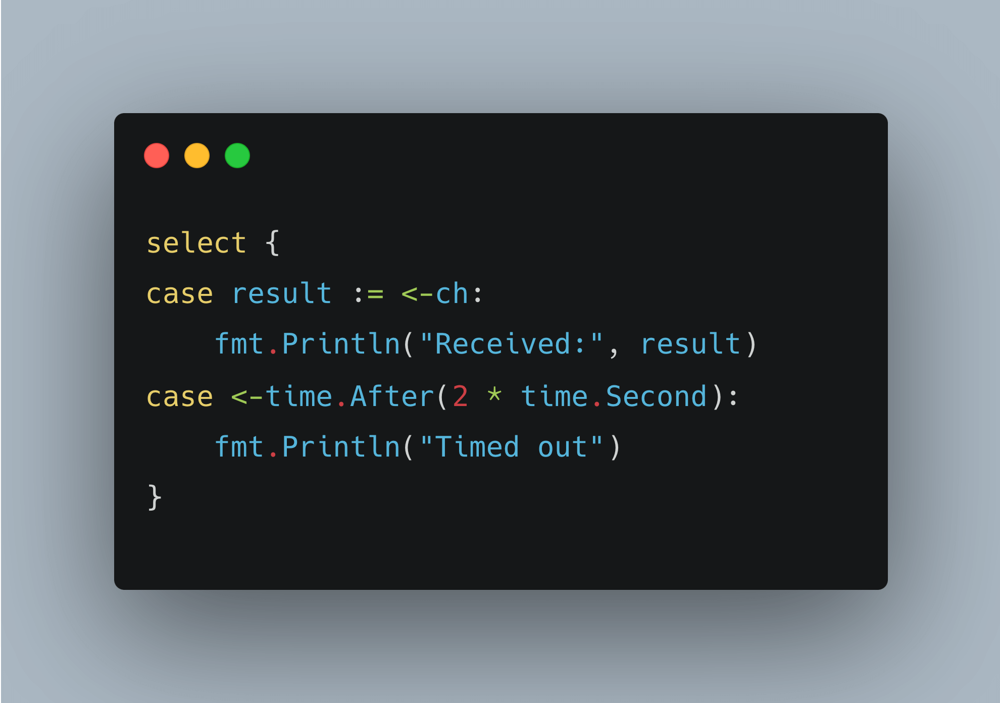

# Tip #29 避免使用 context.Background()，使你的协程具备承诺性

>  原始链接：[Golang Tip #29: Avoid context.Background(), make your goroutines promisable.](https://twitter.com/func25/status/1761025801716392106)

> 译者注：这里的承诺性（promisable）指的是协程运行的最终状态应该是确定的，而不是无期限地一直运行下去，这就像协程给了使用方一个承诺：我要么执行成功，要么因为超时等原因取消执行，但最终在有限时间内一定会有一个明确的状态。

我们经常使用 Golang 协程处理并发任务，并且这些协程经常需要执行阻塞任务，比如：

* 执行 HTTP 请求
* 执行数据库查询、命令
* 从通道读取和写入数据
* ...

> “为什么要避免直接使用 `context.Background()` 呢？”

我们必须确保这些操作不会无限期地挂起或阻塞协程（而没有逃逸途径），以避免资源泄漏、应用程序无响应、死锁等问题。

一般来说，有两种方法可以使你的协程具有承诺性：取消和超时。

因此，你启动的每一个协程都在做出一个承诺：“我要么完成我的任务，要么及时告诉你为什么我不能完成，并且你可以在任何时候取消我的任务。”

以下是一些关键点：

* 在底层实现中，`WithTimeout` 实际上是使用 `WithDeadline` 封装的；
* 一些 `XXXCause` 函数是在 Go 1.20 和 Go 1.21 版本中刚刚新增的；
* 如果在使用 `XXXCause` 类函数时发生超时，它会提供更详细的错误信息：“context deadline exceeded: custom message”。

> “那么关于通道呢？我可不想在一个通道上永远等待。”

有很多种办法可以避免在通道上永远等待，但都会用到 `select{}`。

上面代码中有一个微妙的注意事项：`time.After` 可能会导致内存泄露，请考虑使用 `time.NewTimer(duration)`。
