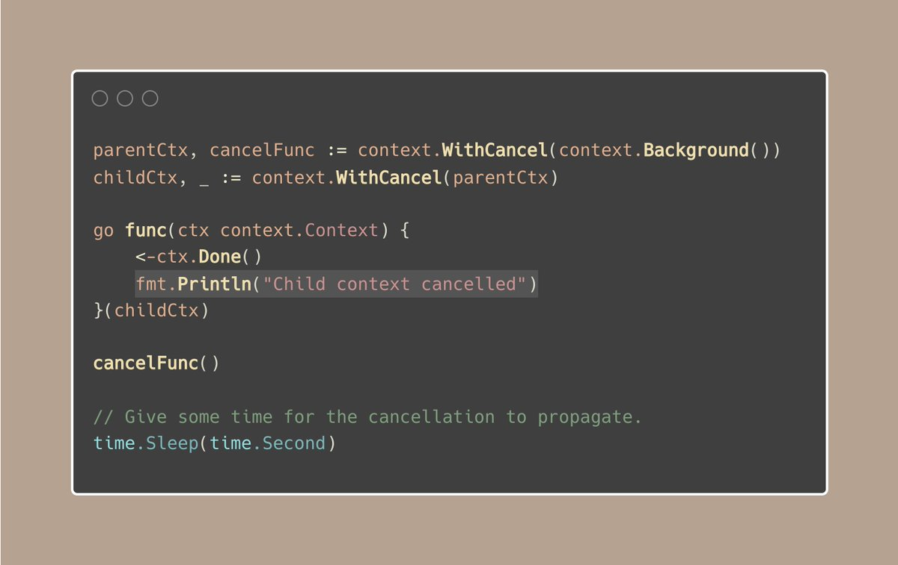
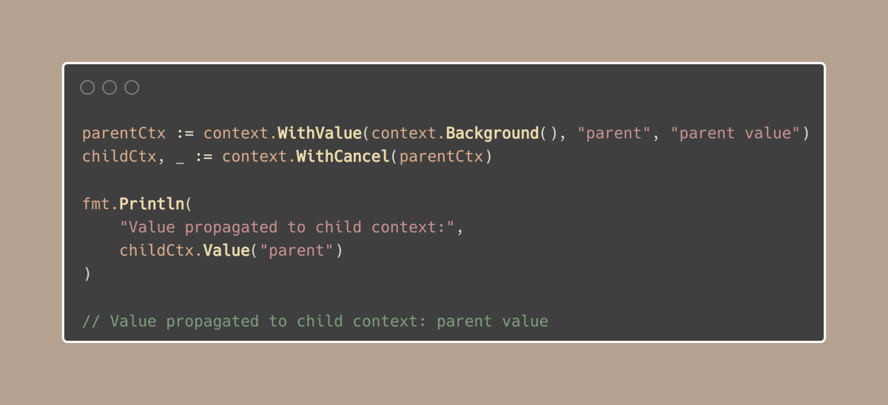
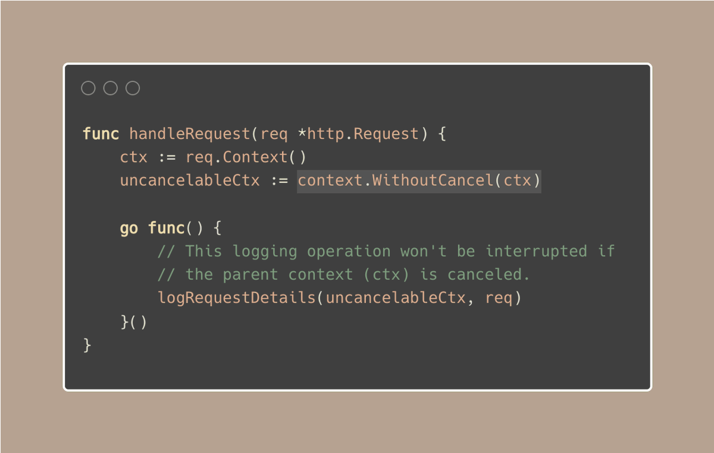

#  Tip #30 使用context.WithoutCancel()继续上下文操作

>  原始链接：[Golang Tip #30: Keep contexts going with context.WithoutCancel()](https://twitter.com/func25/status/1761388781201174853)
>

我们已经知道,当父上下文被取消时,它的所有子上下文也会被取消,对吗?

但有时候,这不是我们想要的。在某些场景下,我们需要某些操作在父上下文被取消时继续进行,不被中断。想象一下,你正在处理一个HTTP请求,在请求被取消(客户端超时、断开连接等)的情况下,你仍然希望记录请求详细信息并收集指标。

> "啊,我只需要为这些操作创建一个新的上下文就可以了"

这是一个解决方案,但新的上下文缺少原始事件上下文中的值,而这些值对于诸如记录、收集指标等任务很重要。只有子上下文才能传播这些值:

现在,回到我们的HTTP示例,这里是解决方案:

`WithoutCancel`确保这些操作可以在请求被取消时仍然完成,而不会被中断。顺便说一下,这个函数是在Go 1.21中添加的。

