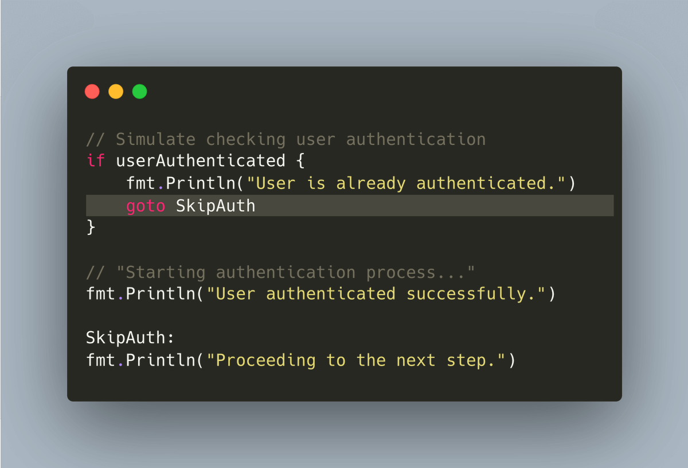
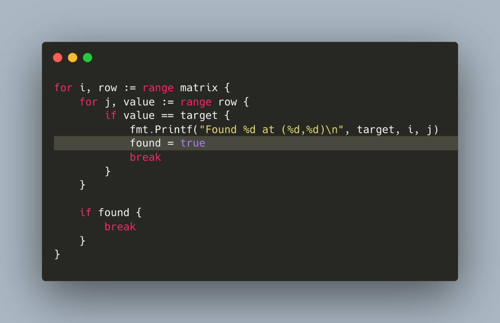
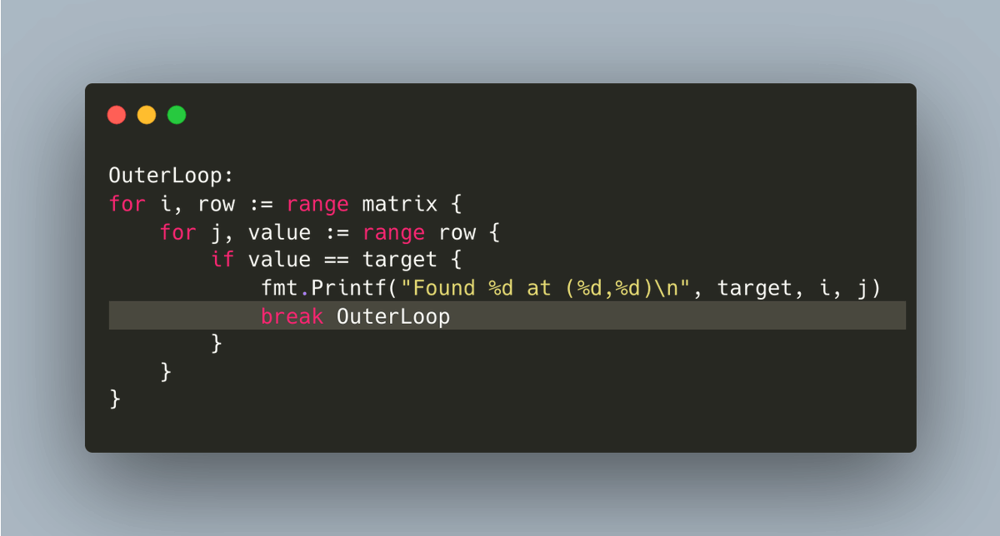
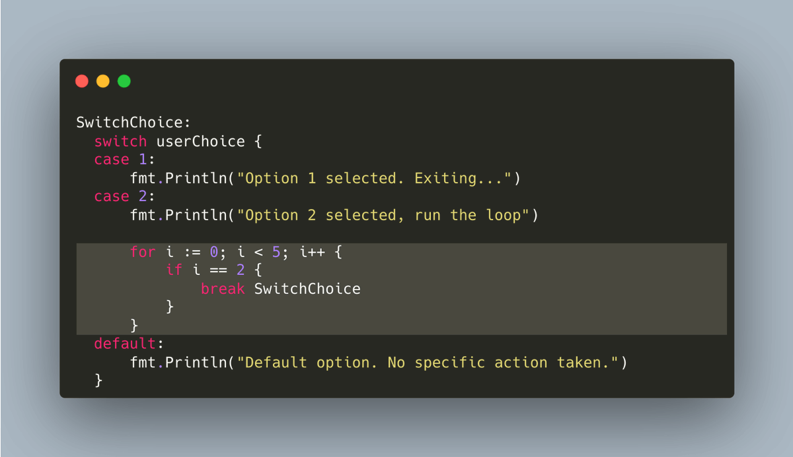

# Tip #31 使用跳转标签让break和continue语句更简洁

> 原始链接：[Golang Tip #31: Loop labels for cleaner breaks and continues](https://twitter.com/func25/status/1761694371240702098)
>

通常避免使用标签和`goto` 语句，因为会降低代码可读性，使其难以理解。

上面简短的示例看起来很清晰易懂。但是随着代码复杂度的增加，可读性会大大降低：

* 你可能要在距离`goto` 语句“数百英里”之外才能找到目的标签。

* 你需要在代码上下文中去寻找`goto`语句跳转的目的标签在哪里。

### 跳转标签

例如，在处理嵌套循环时，某些情况下使用跳转标签是很不错的实践。

想象一下，我们在二维数组中搜索一个数字：

此时，你有一个更优雅的解决方案：在循环语句处声明跳转标签。

一旦声明了标签以后，你就可以使用`break` 或 `continue` 后跟一个标签实现不仅本层循环的跳转，任何外层循环的跳转都可以。

这样做的结果是？

代码不仅简短，而且更加清晰、明了。

我们可以在`break` 和 `continue` 语句中都使用标签。

另外一个有用的实例是当循环代码块中包含`select{}`。

如果你在`select` 代码块中使用了不带标签的`break`，只会跳出`select`代码块，而不会跳出包含它的外层循环。

本节的技巧主要针对循环，但也可以使用在其他地方，比如`switch`实例：

